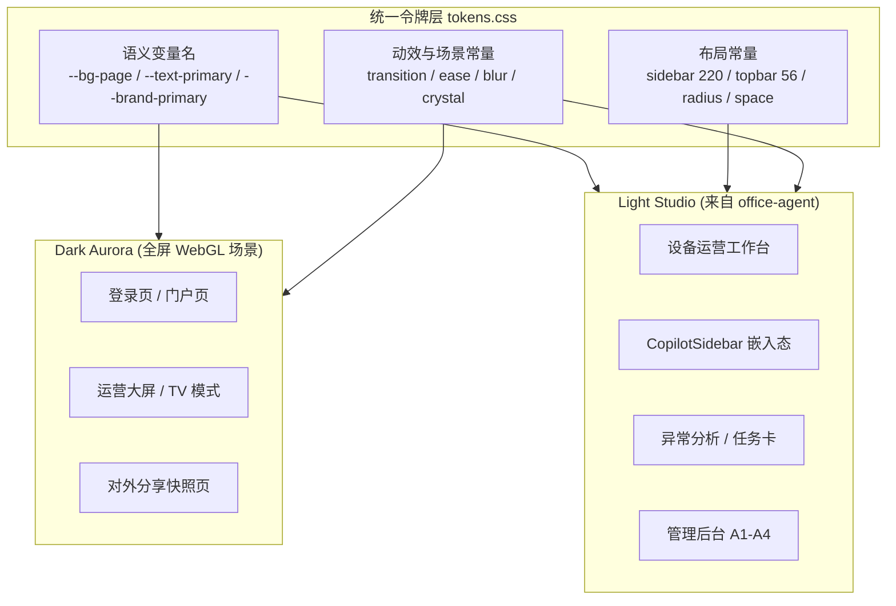
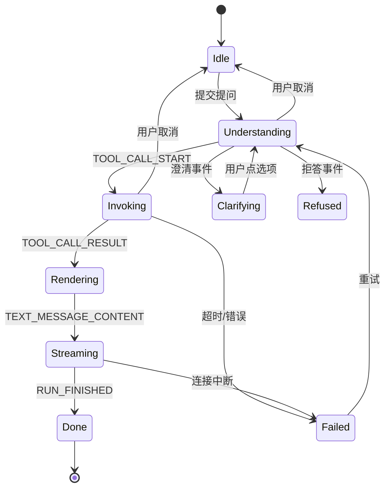

> 一句话定位：把 **office-agent 的 B 端信息密度与令牌化布局** 和 **storytellingnoomo-rebuild 的全屏 3D 叙事引擎** 融合成一套「**双模式设计体系**」——登录/门户页用全屏 WebGL「冰晶车魂」场景建立品牌记忆，工作台用 Light Studio 保证 8 小时可用性，两者共享同一套设计令牌。

> [!note] 🧭
> **融合结论先行**：不做「深色炫酷工作台」（那是 8 小时作业场景的效率杀手），也不做「淡味登录页」。Dark 侧直接对齐源项目的规格：**全屏 3D 场景 + 指针跟随 + 滚动导演 + 数字预加载**；Light 侧承载所有高频作业。二者由同一份 `tokens.css` 的双 theme 驱动。

---

## 1. 参考基线拆解

| 来源 | 可直接复用的资产 | 本项目如何吸收 | 要放弃的部分 |
| --- | --- | --- | --- |
| **office-agent**<br>`frontend/static/css/tokens.css` | 完整设计令牌体系（品牌色 / 语义色 / 4 级文字灰阶 / 3 级阴影 / 8 倍数间距）、布局常量（sidebar 220px、topbar 56px、content 1440px）、原子按钮类、「业务样式禁止硬编码颜色」的纪律 | **整套令牌结构直接继承**，只替换色值与新增 dark theme；工作台布局常量原样沿用 | 单文件 123KB 的 `index.html`（不可维护）；`--login-split-*` 双栏令牌（本项目作废） |
| **storytellingnoomo-rebuild**<br>`app/engine/`  • `app/assets/css/main.css` | **一整套自研 three.js 引擎**（场景 / 相机 / 管道 / 时间轴 / 指针 / 性能分级 / 图层控制）、玻璃折射 shader、骨骼动画硬切机制、弹簧跟随指针、深空蓝色板、Tailwind v4 `@theme` 组织方式、超大字号梯度、衬线斜体标题字、blur 层级、`cubic-bezier(.65,.05,.36,1)` 缓动 | **Dark 模式的场景架构与视觉语言全部来自这里**（见 §7） | 62.5% 根字号（与 B 端组件库 rem 假设冲突）；商用字体需换授权替代；音效默认关闭 |

### 1.1 融合原则（四条）

- **单一令牌源**：所有颜色/间距/圆角/阴影只能引用 CSS 变量，Dark 与 Light 只是同名变量换值，业务组件**零改动**
- **炫酷有边界**：WebGL 场景与重动效只允许出现在「低频、单次、非作业」页面（登录 / 门户 / 分享页 / 大屏）
- **密度优先**：工作台字号基准 13～14px，表格行高 36px；车联网运营要一屏看尽可能多的车与告警
- **流式即体验**：每个 AG-UI 事件都有骨架态与增量渲染路径，禁止「转圈等 8 秒再一次性出现」

---

## 2. 双模式设计体系总览



|   | Dark Aurora | Light Studio |
| --- | --- | --- |
| 主视觉 | 全屏 WebGL「冰晶车魂」单场景 | 三区布局，无装饰图形 |
| 底色 | `#051125` → `#060b1d` 径向渐变 | `#F9FAFB` 页面 / `#FFFFFF` 卡片 |
| 强调色 | `#88AEFF` 极光蓝 + `#6248A4` 紫辅助 | `#1E40AF` 深空蓝 |
| 字号 | Hero 66～96px，衬线斜体点睛 | 正文 13～14px，无衬线 |
| 动效 | 场景入场编排 / 指针跟随 / 滚动导演（≤ 2.2s） | 仅功能性过渡（150～300ms） |
| 信息密度 | 低（一屏一个观点） | 高（一屏 30+ 行数据） |

---

## 3. 设计令牌（统一 `tokens.css`）

```css
/* ============ 基础层：与 office-agent 一致的语义命名 ============ */
:root {
  /* 品牌主色：采纳 office-agent 选项 A 深空蓝，与 Dark 模式天然同源 */
  --brand-primary: #1E40AF;
  --brand-primary-hover: #1E3A8A;
  --brand-primary-light: #EFF6FF;
  --brand-primary-soft: #DBEAFE;

  /* 语义色（与品牌色解耦，车联网状态直接映射） */
  --status-success: #059669; --status-success-bg: #ECFDF5;  /* 在线 / 正常 */
  --status-warning: #D97706; --status-warning-bg: #FEF3C7;  /* 告警 */
  --status-danger:  #DC2626; --status-danger-bg:  #FEE2E2;  /* 故障 / 离线超阈值 */
  --status-info:    #0EA5E9; --status-info-bg:    #F0F9FF;  /* 充电 / 行程中 */
  --status-neutral: #6B7280; --status-neutral-bg: #F3F4F6;  /* 离线 / 无数据 */

  /* 文字四级灰阶 / 背景 / 圆角 / 间距 / 阴影：沿用 office-agent 原值 */
  --text-primary: #111827; --text-secondary: #4B5563;
  --text-tertiary: #9CA3AF; --text-on-brand: #FFFFFF;
  --bg-page: #F9FAFB; --bg-surface: #FFFFFF; --bg-input: #F3F4F6;
  --radius-md: 8px; --radius-lg: 12px; --radius-xl: 16px; --radius-full: 999px;
  --space-2: 8px; --space-4: 16px; --space-6: 24px; --space-12: 48px;
  --shadow-card: 0 2px 8px rgba(17,24,39,.06);
  --shadow-modal: 0 20px 60px rgba(17,24,39,.15);

  /* 工作台布局常量（--login-split-* 已废弃：登录页不再分栏） */
  --sidebar-width: 220px;
  --topbar-height: 56px;
  --content-max-width: 1440px;
  --chat-panel-width: 420px;      /* 对话区默认宽，可拖拽 320~640 */
  --copilot-sidebar-width: 400px; /* 嵌入宿主平台时的抽屉宽 */
  --table-row-height: 36px;
  --freshness-bar-height: 28px;

  --transition-fast: .15s ease;
  --transition-base: .2s ease;
  --transition-slow: .3s cubic-bezier(.4,0,.2,1);
}

/* ============ Aurora / 冰晶层：来自 storytellingnoomo ============ */
:root {
  --aurora-bg-deep:   #051125;
  --aurora-bg-void:   #060b1d;
  --aurora-blue:      #3762BE;
  --aurora-blue-lift: #88AEFF;   /* 极光高光、轨迹线 */
  --aurora-blue-deep: #00276E;
  --aurora-violet:    #6248A4;   /* 仅用于渐变第二停点 */
  --aurora-ink:       #29345A;

  --blur-xs: 4px; --blur-sm: 8px; --blur-lg: 16px; --blur-2xl: 40px;
  --ease-editorial: cubic-bezier(.65,.05,.36,1);

  --text-hero-sm: 38px; --text-hero: 66px; --text-hero-xl: 96px;

  --glass-bg: rgba(255,255,255,.06);
  --glass-border: rgba(136,174,255,.18);
  --glass-shadow: 0 24px 80px rgba(0,39,110,.45);

  /* 冰晶场景专用（见 §7） */
  --crystal-core:      #88AEFF;               /* 电池核心自发光 */
  --crystal-facet:     rgba(136,174,255,.28); /* 冰晶碎片边缘 */
  --crystal-alert:     #FF7A45;               /* 告警脉冲（全站唯一暖色） */
  --bloom-strength:    .8;
  --scene-yaw-limit:   12deg;
  --scene-pitch-limit: 6deg;
  --ignite-duration:   900ms;
}

/* ============ Dark 模式覆盖：同名变量换值 ============ */
[data-theme="dark"] {
  --bg-page: var(--aurora-bg-void);
  --bg-surface: rgba(255,255,255,.04);
  --bg-input: rgba(255,255,255,.06);
  --text-primary: #F5F5F5;
  --text-secondary: #B8C4E0;
  --text-tertiary: #7C8AAE;
  --brand-primary: var(--aurora-blue-lift);
  --brand-primary-hover: #A5C0FF;
  --border-default: rgba(136,174,255,.16);
  --shadow-card: 0 8px 32px rgba(0,20,60,.5);
}

/* ============ 全局降级开关 ============ */
@media (prefers-reduced-motion: reduce) {
  *, *::before, *::after { animation-duration: .01ms !important; transition-duration: .01ms !important; }
}
```

> [!tip] 💡
> 关键取舍：放弃源项目的 `html{font-size:62.5%}`。那套 1rem=10px 标度在营销站很好用，但会与 B 端组件库（Ant Design / shadcn）的 rem 假设冲突，且工作台大量 12/13px 文本用 rem 表达反而更难读。统一 16px 基准 + px 令牌。

### 3.1 字体策略

| 角色 | 字体 | 用在哪 |
| --- | --- | --- |
| UI 无衬线 | `Inter`  • `PingFang SC` / `Microsoft YaHei` 回退 | 全站正文、表格、按钮 |
| 数字等宽 | `Inter`  • `font-variant-numeric: tabular-nums` | 里程、SOC、告警数——**表格数字必须对齐** |
| 点睛衬线斜体 | `Playfair Display Italic`（OFL，替代源项目的 TheSeasons 试用字体） | 仅 Dark 页 hero 中 1～3 个词，如「*会说话*」 |
| 代码/参数 | `JetBrains Mono` | 执行过程区的 capability 参数与 SQL 快照 |

---

## 4. 技术栈与工程结构

| 层 | 选型 | 理由 |
| --- | --- | --- |
| 框架 | **Next.js App Router**（PRD 已定） | 协议代理与页面同工程，SSE 转发天然支持 |
| 样式 | **Tailwind v4 **`**@theme**`**  • tokens.css** | 吸收 storytellingnoomo 的组织方式，令牌进 `@theme` 后可直接用工具类 |
| 组件底座 | **shadcn/ui + Radix** | 无样式绑定，能被令牌完全接管；无障碍开箱可用 |
| **3D 引擎** | **three.js + GLTFLoader + AnimationMixer + postprocessing**，自建 `engine/` 目录对齐源项目分层 | 登录与门户的主视觉是完整 WebGL 场景，不是背景图；源项目分层可直接继承 |
| 动效编排 | Dark 页用 **GSAP timeline + Framer Motion**（场景内用弹簧 Spring）；Light 页只用 CSS transition | 把重动效与 WebGL 包体隔离在门户路由 |
| 协议 | `@ag-ui/client` HttpAgent（PRD 已定） | — |
| 图表 | **Vega-Lite**  • `deck.gl` / MapLibre 做轨迹 | ChartSpec 直接是 Vega-Lite spec，免自研协议；地图是车联网强需求 |
| 表格 | **TanStack Table + Virtuoso 虚拟滚动** | 千行明细不掉帧（capability `max_rows:1000`） |
| 状态 | Zustand（会话/线程）+ TanStack Query（结果缓存） | 与后端 5～15 分钟缓存策略对齐 |

```javascript
frontend/
├─ app/
│  ├─ (portal)/                 # Dark Aurora 路由组（全屏 3D）
│  │  ├─ layout.tsx             # data-theme=dark，惰加载 engine chunk
│  │  ├─ page.tsx               # 门户（滚动导演同一场景）
│  │  └─ login/page.tsx         # 登录页
│  ├─ (studio)/                 # Light Studio 路由组
│  │  ├─ layout.tsx             # Sidebar + Topbar 骨架
│  │  ├─ workbench/page.tsx     # P1 设备运营工作台
│  │  ├─ anomaly/[id]/page.tsx  # P3 异常分析 / 任务卡
│  │  ├─ chart/[id]/page.tsx    # P4 全屏图表分析
│  │  └─ admin/                 # A1 capability / A2 A2A / A3 记忆 / A4 看板
│  ├─ embed/copilot/page.tsx    # P2 嵌入式 CopilotSidebar
│  └─ api/ag-ui/route.ts        # 协议代理（SSE 透传）
├─ engine/                      # 对齐 storytellingnoomo 的 app/engine
│  ├─ core.ts                   # Tick / events / Spring / appSettings
│  ├─ camera.ts  pipeline.ts    # 相机与后处理（Bloom）
│  ├─ pointer.ts timeline.ts    # 指针 NDC / 滚动时间轴绑定
│  ├─ performance.ts            # 四档分级（见 7.6）
│  ├─ layerController.ts        # 图层开关
│  └─ scene/
│     ├─ vehicle.ts             # 冰晶车体 + ChassisLookAt（对应 phoenix.ts）
│     ├─ crystals.ts            # 15 枚能力冰晶
│     ├─ trails.ts              # 轨迹流星带 GPU 粒子
│     ├─ glass/                 # 折射材质 + shader + colorMap
│     └─ aurora.ts  env.ts      # 地平线极光环（对应 sun.ts）
├─ components/
│  ├─ primitives/               # Button / Badge / Card / Tooltip
│  ├─ chat/                     # MessageList / Composer / StageIndicator
│  ├─ result/                   # ResultCard / ClarifyBubble / RefuseCard / FailCard
│  ├─ data/                     # DorisTable / ChartPanel / ChartTypeSelector / FreshnessBar
│  ├─ vehicle/                  # EventTimeline / TrackMap / BenchmarkBar
│  └─ portal/                   # Preloader / GlassCard / HeroType / IgniteButton
├─ styles/tokens.css
└─ lib/ag-ui/                   # 事件解析、状态机、重连
```

---

## 5. 工作台布局骨架（承自 office-agent）

```javascript
+----------------------------------------------------------------------+
| Topbar 56px   [Logo] 设备运营 Agent    ⌘K 搜索   车队切换   头像   |
+------------+------------------------+--------------------------------+
| Sidebar    | Chat 对话区 420px      | 结果区 flex-1                  |
| 220px      |                        |                                |
| 工作台     | 用户提问               | FreshnessBar 28px              |
| 异常       | > 正在理解...           | ------------------------------ |
| 分析       | > 调用 alarm_list       | ChartPanel (Vega-Lite)         |
| 我的指标   | 流式解释文本...         | ------------------------------ |
| ---------- | [结果卡片]             | DorisTable                     |
| 管理后台   | > 执行过程（默认收起）   | 虚拟滚动 36px/行              |
|            | [Composer 输入框]       |                                |
+------------+------------------------+--------------------------------+
```

| 区域 | 规格 | 行为 |
| --- | --- | --- |
| Sidebar | 220px，可折叠至 56px（仅图标） | 折叠态记忆到 localStorage；「我的指标」承接指标订阅 |
| Topbar | 56px，`--bg-surface`  • 1px 下边框 | ⌘K 唤起命令面板（问题 / capability / VIN 三合一）；车队切换即权限上下文切换，切换后清空结果区缓存 |
| Chat 区 | 420px 默认，拖拽 320～640，宽度持久化 | 窄屏（&lt;1280px）改为 Tab 切换「对话 / 结果」 |
| 结果区 | flex-1，上图下表，比例可拖拽 | **三区共享同一次 **`**TOOL_CALL_RESULT**`，切图 / 切列不重新请求 |

---

## 6. 页面清单（对齐 PRD 第 8 章）

| # | 页面 | 模式 | 阶段 | 前端关键实现点 |
| --- | --- | --- | --- | --- |
| P0 | 登录页 | Dark | P0 | **全屏 WebGL「冰晶车魂」单场景**  • 悬浮玻璃登录卡 + 衬线斜体 hero（见 §7） |
| P1 | 设备运营工作台 | Light | P0 | 三区联动、AG-UI 事件路由、虚拟表格、Vega-Lite 渲染 |
| P2 | CopilotSidebar（嵌入） | Light | P0 | iframe / Web Component 双封装；`postMessage` 接收宿主车辆上下文（VIN、车队、时区） |
| P3 | 异常分析 / 任务卡 | Light | P1 | EventTimeline + BenchmarkBar + 任务卡表单 + PDF 导出（打印样式表） |
| P4 | 全屏图表分析 | Light | P1 | 参数面板改参数直接重跑 capability，**不过模型** |
| P5 | 指标订阅看板 | Light | P1 | 把一次问答「固定」为卡片，日 / 周自动刷新 + 异常高亮 |
| P6 | 分析结果分享页 | Dark | P2 | 只读快照、大字号结论；背景用静态 Aurora 层（不跑 WebGL） |
| A1 | Capability 管理后台 | Light | P0 | 元数据表单（含 `aliases` 标签编辑器）、试跑面板、上下线开关 + 变更审计 |
| A2 | A2A / MCP 授权台 | Light | P2 | 注册审批流、scope 勾选树、credential 轮换与吊销二次确认 |
| A3 | 记忆治理台 | Light | P1 | proposal 审核队列、ACL 可视化、diff 视图 |
| A4 | 效果看板与审计 | Light | P1 | 成功率 / 延迟 / 👍率趋势、未覆盖问题榜、调用审计表 |

---

## 7. 登录页 / 门户页：全屏「冰晶车魂」场景

> [!note] 🔥
> **作废 50/50 双栏**。源项目不是「左图右表单」，而是 **一个占满全屏、有生命的 3D 场景，UI 只是浮在它之上的一层**。本页改为同构方案：全屏 WebGL 单场景 + 悬浮玻璃登录卡，`--login-split-*` 令牌废弃。

### 7.1 场景概念：从「凤凰 + 冰晶」到「冰晶车魂」

先看源项目到底做了什么——`app/engine/` 是一套完整自研 three.js 引擎，而不是一个粒子背景：

| 源项目模块 | 它实际在做什么 | 本项目对应物 |
| --- | --- | --- |
| `scene/phoenix.ts`<br>（凤凰） | GLTF 骨骼动画 + `AnimationMixer` 四段 clip 硬切（stop → uncacheAction → uncacheClip → play）；`NeckLookAt` 用两个 `Spring(50, 15)` 把 `b_neck` 颈骨弹簧 lerp 到指针方向——**让主体「活」的关键就是这一笔** | **GlassVehicle 冰晶车魂**：车头随指针微转（`ChassisLookAt`，把 `b_neck` 换成 `b_chassis_yaw`，弹簧参数直接沿用）；四段 clip = 待机 / 呼吸光流 / 告警脉冲 / 点火升起 |
| `scene/glass/`<br>（冰晶） | `shaders.ts`  • `materials.ts`  • `colorMaps.ts`：折射玻璃材质 + 色彩映射贴图；`glassSupport.ts` 做能力检测 | **车体本身就是冰晶**：半透明折射车壳 + 内部可见的发光电池核心 + 表面流动的数据光带 |
| `scene/sun.ts` / `env.ts` | 光源与环境贴图 | **地平线极光环**（低位背光，把车体轮廓勾出来） |
| `timeline.ts`  • `addFieldDependency` | 把场景字段（如 `Phoenix_animationId.position.x`）绑定到滚动时间轴，**滚动就是导演** | 门户页滚动驱动同一场景（见 7.7） |
| `performance.ts` / `layerController.ts` | 运行时分级与图层开关 | 四档降级策略（见 7.6） |
| `Preloader.vue` / `NavigationsReleaseSpirit.vue` / `SoundButton.vue` | 数字进度预加载 → 「释放灵魂」入口按钮 → 可选音效 | 预加载进度数字 → **「唤醒 Agent」点火按钮** → 可选音效（默认关） |

所以本项目的主角不是凤凰，是 **一台悬浮在深空中的冰晶车体，身上跑着真实数据的光**。它把产品一句话说完了：车是透明的，数据是可见的。

### 7.2 全屏单场景布局

```javascript
+---------------------------------------------------------------+
|  LOGO                                     音效 o    中/EN     |  <- L3 浮层 UI
|                                                               |
|            *      能力冰晶（环绕 15 枚）      *             |
|        *                                        *             |
|                     +---------------+                         |
|    *            //  |   冰晶车体   |  \\           *          |  <- L1 WebGL
|               //    +-----(o)-------+    \\                   |     100vw x 100vh
|          <---- 轨迹流星带     ↑ 发光电池核心 ---->         |
|                                                               |
|   ==================  地平线极光环  ==================      |
|                                                               |
|              让每一台车都 *会说话*                          |  <- hero 居中靠下
|                                                               |
|                +-------------------------+                    |
|                | 账号  [_______________] |                    |  <- 玻璃卡 420px
|                | 密码  [_______________] |                    |     悬浮于场景之上
|                | [    唤 醒  Agent    ] |                    |
|                | ---- 企业 SSO 登录 ---- |                    |
|                +-------------------------+                    |
|      15 项受控能力 · 零自由 SQL · 每次回答可审计          |
+---------------------------------------------------------------+
```

**层级关系**（对应 `layerController.ts`）：

- **L0 背景**：径向渐变 `#051125` → `#060b1d` + 极光模糊椭圆（blur 40px，40s 漂移），纯 CSS
- **L1 WebGL Canvas**：`position: fixed; inset: 0`，冰晶车体 + 能力冰晶 + 轨迹流星带 + 极光环
- **L2 后处理**：Bloom（只给电池核心与光带）+ 轻微胶片噪点，**不用 DOF**（会把登录表单的可读性拖下水）
- **L3 DOM UI**：hero 文字 + 玻璃登录卡 + 顶部工具条，均为真 DOM（**可选中、可无障碍、可自动填充密码**）

### 7.3 场景元素规格

| 元素 | 实现 | 产品含义 |
| --- | --- | --- |
| **冰晶车体**<br>GlassVehicle | 低模车壳（≤ 40k 三角面）+ `MeshPhysicalMaterial`：`transmission:1`、`thickness:1.2`、`roughness:.08`、`ior:1.45`、`iridescence:.3`，配 HDR 环境贴图。车头随指针 yaw ±12° / pitch ±6°，弹簧 `Spring(stiffness 50, damping 15)` | 车是透明的——你能看进去 |
| **发光电池核心** | 车体内部悬浮六棱体，自发光 `--crystal-core`，2.4s 呼吸周期；Bloom 强度 0.8 | SOC / 健康度的拟人化 |
| **表面数据光带** | 自定义 shader：沿车壳 UV 流动的扫描线（参考源项目 `glass/shaders.ts` 的 colorMap 采样思路），**步进式流动而非匀速**——模拟 CAN 信号上报节奏 | 数据正在实时上行 |
| **15 枚能力冰晶** | 六棱柱碎片环绕车体缓慢公转（周期 60s），每枚绑定一个 capability；hover 时碎片点亮并弹出显示名（如「告警次数统计」），点击直达登录后的示例提问 | 把「只能回答 15 类问题」从局限变成卖点：**能力是有形的、可数的** |
| **轨迹流星带** | GPU 粒子（≤ 3000）沿 3～4 条贝塞尔路径流动，尾迹渐隐；偶发 `--crystal-alert` 脉冲点 = 告警事件 | 车队在跑，告警在发生 |
| **地平线极光环** | 低位背光平面，蓝 → 紫渐变（`--aurora-blue` → `--aurora-violet`），把车体轮廓勾亮 | 取代源项目 `sun.ts` |
| **玻璃登录卡** | 420px 居中偏下；`background: var(--glass-bg); backdrop-filter: blur(16px); border: 1px solid var(--glass-border); border-radius: var(--radius-xl)`；与指针反向视差 ±6px | UI 浮在场景之上，而不是占掉一半屏幕 |
| **点火按钮** | 「唤醒 Agent」：`linear-gradient(90deg,#3762BE,#88AEFF)`，hover 流光 800ms；点击后触发车体 `ignite` clip（核心爆亮 → 光带加速 → 镜头推进），**与登录请求并行**，失败则回弹 | 把等待变成仪式感，不增加真实耗时 |

### 7.4 交互语言

| 输入 | 反馈 |
| --- | --- |
| 指针移动 | 车头弹簧转向（上限 ±12°）+ 镜头微视差 + 玻璃卡反向位移；指针离开 1.5s 后回中 |
| hover 能力冰晶 | 碎片点亮 + tooltip 显示 capability 名与一句试问例句 |
| 输入框聚焦 | 镜头微推进 + 背景饱和度降 15%，**把注意力让给表单** |
| 滚动（仅门户页） | 驱动时间轴：镜头环绕车体 + 切换车体 clip（待机 → 告警脉冲 → 拆解展示） |
| 音效 | 默认**关闭**（B 端办公环境），右上角开关；开启后仅环境低频 + 点火一声 |

### 7.5 入场编排

```mermaid
gantt
  dateFormat SSS
  axisFormat %L
  section 预加载
  预加载数字进度 0-100 :000, 800ms
  section 场景入场
  底色与极光环浮现 :800, 400ms
  车体浮升与折射成型 :950, 700ms
  电池核心点亮与呼吸 :1300, 400ms
  能力冰晶逐枚弹入 :1450, 600ms
  轨迹流星带开始流动 :1600, 400ms
  section UI
  hero 标题逐行上浮 :1500, 450ms
  玻璃登录卡缩放淡入 :1750, 400ms
```



> [!warning] ⚠️
> **四条硬约束（炫酷不能碍事）**：
1. **登录表单不等场景**——玻璃卡与 WebGL 并行加载，DOM 首帧即可输入；预加载进度只遮场景，**不遮表单**。
2. WebGL 链路是渐进强化：`glassSupport` 检测失败 / WebGL2 不可用 / `prefers-reduced-motion` 时直接走静态层，登录功能零影响。
3. 场景与动效代码全部在 `(portal)` 路由组的独立 chunk，**绝不进工作台首屏包体**。
4. 入场总时长 ≤ 2.2s（含预加载）；回访用户（localStorage 标记）跳过入场，直接稳态。

### 7.6 性能分级与降级（对应源项目 `performance.ts`）

首帧采样 GPU 与屏幕，运行时持续监控帧率，**只降不升**（避免抖动）：

| 档位 | 触发条件 | 场景配置 |
| --- | --- | --- |
| **High** | 独立显卡 / ≥ 55fps | 折射全开 + Bloom + 3000 粒子 + 15 枚冰晶 + DPR 2 |
| **Mid** | 集成显卡 / 45～55fps | `transmission` 降为半透明近似 + Bloom 保留 + 1200 粒子 + DPR 1.5 |
| **Low** | &lt; 45fps 持续 2s / 移动端 | 关后处理、粒子改 CSS、冰晶降为 6 枚、DPR 1、车体只保留呼吸动画 |
| **None** | WebGL 不可用 / reduced-motion / 省电模式 | 静态层：预渲染的车体 WebP（≤ 120KB）+ CSS 极光渐变 + SVG 轨迹，视觉完整度 ≈ 70% |

另外：页面隐藏（`visibilitychange`）立即暂停 `requestAnimationFrame`；登录成功跳转时 `dispose()` 释放几何体与纹理（沿用源项目 `stopAllAction` → `uncacheRoot` 的清理顺序）。

### 7.7 门户页：同一场景的滚动叙事

不新建场景，**滚动就是导演**（沿用 `timeline.ts` 把场景字段绑定到滚动进度）：

| 屏 | 镜头与场景 | 文案 |
| --- | --- | --- |
| 1 | 车体正面居中，冰晶环绕 | 让每一台车都 *会说话* |
| 2 | 镜头环到侧后方，轨迹带升起铺满屏幕 | 问一句话，得一张表一张图（演示对话气泡浮入） |
| 3 | 车体拆解，告警部位红橙脉冲 | 异常不只告诉你发生了，还告诉你为什么 |
| 4 | 镜头拉远，15 枚冰晶展开成网格 | 15 项受控能力 · 零自由 SQL · 每次回答可审计 |
| 5 | 车体回中并点亮 | CTA：唤醒 Agent → 直达登录 |

> [!note] 🎯
> **为什么是冰晶车体而不是其他**：它同时满足三件事——能直接复用源项目的玻璃折射 shader 与骨骼动画框架（工程上不是从零开始）；能一眼说清产品（车 + 可见的数据）；且 15 枚冰晶把「白名单能力」这个很容易被吐槽为限制的设计，变成了可见、可数、可信的卖点。

---

## 8. 工作台核心：AG-UI 事件 → 组件映射

这是前端最关键的契约表，需与后端一次性对齐。

| AG-UI 事件 | 前端动作 | 视觉表现 |
| --- | --- | --- |
| `RUN_STARTED` | 插入 assistant 消息占位，StageIndicator = 正在理解 | 三点脉冲 + 「正在理解你的问题」 |
| `TOOL_CALL_START` | StageIndicator = 正在调用能力，展示 capability 显示名 | 「正在调用 *按类型统计告警次数*」+ 进度条 |
| `TOOL_CALL_ARGS`（增量） | 写入执行过程区（默认收起） | 参数以 JetBrains Mono 逐步显现 |
| `TOOL_CALL_RESULT` | **一份数据三处消费**：写入结果 store → DorisTable + ChartPanel + FreshnessBar | 表格骨架屏 → 真实行；图表骨架 → 渲染 |
| `TEXT_MESSAGE_CONTENT`（增量） | 流式追加到解释文本，Markdown 增量解析 | 打字机效果，滚动自动跟随（用户上滑则停止跟随） |
| ChartSpec（自定义 tool 事件） | 交给 ChartPanel 渲染 Vega-Lite | ChartTypeSelector 出现可切换类型 |
| 澄清事件 | 渲染 ClarifyBubble，选项按钮携带完整参数 | 点一下即重算，**不让用户重打字** |
| 拒答事件 | 渲染 RefuseCard | 说明边界 + 「提交能力需求」按钮 + 预期响应时效 |
| `RUN_ERROR` / 超时 | 渲染 FailCard | 标出失败环节（理解 / 调用 / 渲染）+ 重试，**绝不显示半截结果** |
| `RUN_FINISHED` | 收起 StageIndicator，展示 👍👎 与追问建议 | 3 个基于当前参数变形的追问 chip |

### 8.1 流式状态机



### 8.2 必须实现的可用性细节（PRD 8.2 逐条落地）

- **可中断**：Composer 在运行中变为「停止」按钮，`AbortController` 断流并保留已收到内容
- **编辑重发**：上一条提问 hover 出现编辑按钮，重发时丢弃其后的所有消息
- **参数微调不走模型**：结果卡右上角「调参数」抽屉，改时间 / TopN 后直接调 capability，UI 标记「已按新参数重算」
- **执行过程可见区**：默认收起，展开显示 capability ID、参数 JSON、数据时效、耗时、扫描行数、**等价 SQL 快照（只读）**
- **空状态**：能力边界说明 + 6～8 个真实可跑通的示例问题（点击直接发送）
- **数据时效条**：结果区顶部常驻 28px 条，格式「数据截至 15:02 · T+0 准实时 · 延迟约 5 分钟」；若存在补传修正，追加「⚠️ 昨日数据已修正」

---

## 9. 车联网专属组件（差异化重点）

| 组件 | 用途 | 设计要点 |
| --- | --- | --- |
| **EventTimeline** | 把告警/故障/行程/充电/围栏事件对齐到一条时间轴 | 横向时间轴 + 5 条泳道，事件按语义色着色；支持刷选放大；点击事件联动下方明细。异常解释的核心载体 |
| **TrackMap** | 轨迹回放 + 事件打点 | MapLibre + deck.gl TripsLayer；播放条与 EventTimeline 双向联动；告警点用脉冲标记 |
| **BenchmarkBar** | 同车型 / 同车队分位对比 | 横向分位带 + 当前车定位针，文案直给「该车 AEB 触发次数在同车型中处于 P95」 |
| **VehicleStatusPill** | 在线 / 离线 / 行驶 / 充电 / 告警状态 | 严格映射 `--status-*` 语义色；离线附带「已离线 26 小时」 |
| **FreshnessBar** | 数据时效与修正提示 | 见 8.2；这是用户信任的第一道保障 |
| **TaskCard** | 处置任务卡 | 结论 + 建议动作 + 责任人/时限表单 + 派单按钮；打印样式表直出 PDF |
| **DorisTable** | 明细表格 | 虚拟滚动、列冻结（VIN / 车牌）、数字 tabular-nums 右对齐、单位后缀、导出 CSV |

---

## 10. 动效与性能预算

| 项 | Dark（门户/登录） | Light（工作台） |
| --- | --- | --- |
| 首屏 JS（gzip） | ≤ 180KB（engine 单独分包、首帧后惰加载） | ≤ 220KB（图表/地图按需懒加载） |
| LCP | ≤ 2.0s | ≤ 1.5s |
| 首个 AG-UI token 到可见 | — | ≤ 200ms（对齐 PRD 首 token &lt; 2s 目标） |
| 动效时长 | 入场编排 ≤ 2.2s（含预加载） | 单次过渡 150～300ms |
| 表格滚动 | — | 1000 行 60fps |
| WebGL 场景 | 目标 60fps；&lt; 45fps 逐级降级（见 7.6） | 不使用 |
| 3D 资产总量 | GLB ≤ 2.5MB（Draco + KTX2），HDR ≤ 400KB | — |

**动效纪律**：工作台只做四类——状态过渡（骨架→内容）、空间关系（抽屉/弹层）、注意力引导（新结果高亮 1 次）、品牌表达