> 一句话定位：后端就是 **一个 Spring Boot 部署制品（支持多副本）+ 一份 capability 元数据 + 四条不可越过的协议边界**——把自然语言确定性地翻译成「白名单能力调用」，把结果流式吐回 AG-UI，并把同一套能力以 A2A 受控开放给其他 Agent。

> [!note] 🧭
> **工程结论先行**：
1. **一个代码库、一个部署制品、N 个运行副本承载两个 AgentProfile**；不拆两套业务服务，不复制会话、记忆与 capability 目录。
2. **LLM 永不产出 SQL**，只产出 `capability_id` + 受判别联合 Schema 约束的结构化参数；SQL 是 Java 侧模板 + PreparedStatement。
3. `**/ag-ui**`** 与 **`**/a2a**`** 是两套端点、两套鉴权、两套错误语义**，共享的只有能力层以下；P2 可用同一制品拆成独立 Deployment 做资源隔离。
4. **权限上下文只来自可信身份系统，ACL 在 Top-K 之前参与查询约束**；`forwardedProps` 只能提供业务上下文，不能扩大权限。
5. **基础设施统一为 Nacos + Redis + MySQL**：Nacos 负责配置与服务发现，MySQL 是控制数据和持久状态的事实库，Redis 只承载缓存、短状态、幂等/限流和可重建检索索引；Doris 继续作为车联网分析数据源。

---

## 1. 设计基线与总体约束

### 1.1 从 PRD 继承的六条硬约束（每条都要可验证）

| 约束 | 后端落地方式 | 怎么证明没被破坏 |
| --- | --- | --- |
| **零自由 SQL** | LLM 输出 Schema 根本没有 `sql` 字段；运行时只接受 `capabilityId`  • 通过 discriminator `oneOf` 校验并反序列化的强类型参数；SQL 模板放在 `resources/capability/*.sql`，走 Code Review | CI 静态扫描：禁止 `java.sql.Statement`、禁止 SQL 字符串拼接、禁止 `String.format` 拼 SQL；单测断言工具 JSON Schema 无 `sql` 属性 |
| **两个 Agent 同一 HarnessAgent** | 一个 Spring Boot 应用，`AgentProfile` 决定 system prompt / capability catalog / 角色上下文；新增 Agent = 新增一份 yaml | 工程里只有一个 `HarnessAgent` 实现类；`AgentProfileRegistry` 单测覆盖两个 profile |
| **AG-UI ≠ A2A** | 两条 `SecurityFilterChain`、两个线程池、两套限流器、两张审计表；A2A 不使用 SSE 事件流 | 架构测试（ArchUnit）：`a2a` 包不得引用 `agui` 包的事件类，反之亦然 |
| **ACL 预过滤** | `MemoryGateway.recall(PermissionContext ctx, RecallQuery q)`——没有 `ctx` 编译不过；MySQL 先维护租户/主体 ACL 事实，Redis Search 查询必须携带同一 ACL 过滤表达式，再对候选做 Top-K，返回后由 MySQL 二次验权 | 越权自动化测试集（见 §16.3）：A 车队用户召回 B 车队记忆必须为 0 条 |
| **Session 不用本地文件上生产** | `AgentStateStore` 接口隔离；`JsonFileAgentStateStore` 仅限本地开发，P0 联调/演示环境起即使用 `MySqlAgentStateStore`，业务代码零改动 | 非 local profile 启动时若检测到 `JsonFile*` 实现则 fail-fast；跨副本恢复纳入 P0 验收 |
| **确定性主链路** | 主链路是显式状态机（Understand → Resolve → Invoke → Render），LLM 只在两个节点被调用：意图/槽位抽取、结论生成 | Trace 里每次运行的 LLM 调用次数 ≤ 3（含一次重试）；超过则告警 |

### 1.2 技术选型

| 层 | 选型 | 版本基线 | 理由 / 约束 |
| --- | --- | --- | --- |
| 运行时 | JDK + Spring Boot（Web MVC + 虚拟线程） | JDK 21 / Boot 3.3.x | SSE 与 Doris 查询都是「长时间阻塞 + 高并发」，虚拟线程比 WebFlux 心智负担低得多，且 JDBC 生态可直接用 |
| 配置中心 / 服务发现 | Nacos + Spring Cloud Alibaba | Nacos 2.x（按现网基线锁定 patch） | 环境隔离、动态配置、服务注册与健康实例发现；不保存 capability SQL、授权事实或明文密钥 |
| Agent 框架 | AgentScope Java | 2.0.x（上线前锁定具体 patch） | 只用它的 Agent/Tool/Session/Trace 抽象；capability beans、校验器、执行器全部写成**普通 Spring 组件**，框架可替换（见 §18） |
| 数据底座 | Apache Doris（MySQL 协议）+ MySQL Connector/J + HikariCP | Doris 2.1.x | 只读账号 + 独立 Resource Group；全量 PreparedStatement |
| 控制数据库 / 持久状态 | MySQL + MyBatis-Plus + HikariCP | MySQL 8.0.x（InnoDB / utf8mb4） | capability、A2A 授权、Session、记忆事实、审计、评测与 Outbox 的唯一事实库；与 Doris 使用独立 DataSource、账号和连接池 |
| 缓存 / 短记忆 / 检索索引 | Redis + Redisson，本地 Caffeine 做 L1；语义检索可启用 Redis Stack / RediSearch | Redis 7.x（模块能力需在环境验收） | 结果缓存、短记忆、SSE 重放、分布式限流与幂等；长记忆正文与 ACL 仍以 MySQL 为准，Redis 索引可全量重建 |
| 异步与解耦 | MySQL Transactional Outbox + RocketMQ | RocketMQ 5.x | 安全审计先与业务状态同一个 MySQL 事务写 Outbox，再异步投递 MQ；反馈、导出、索引同步和告警走 MQ，避免主链路依赖本地磁盘补偿 |
| ORM | MyBatis-Plus（元数据侧）+ 原生 JdbcTemplate（Doris 侧） | 3.5.x | Doris 侧刻意不用 ORM，避免任何动态 SQL 能力被滥用 |
| 校验 | Jakarta Validation + networknt json-schema-validator | — | capability 参数用 JSON Schema 校验，Schema 由元数据自动生成，同时喂给 LLM 做 function calling |
| 韧性 | Resilience4j | 2.x | 每个 capability 独立 TimeLimiter + CircuitBreaker + Bulkhead |
| 可观测 | Micrometer + OpenTelemetry + Prometheus + Grafana + Loki | — | Trace 覆盖率 100%，含 capability 参数与 SQL 快照（脱敏后） |
| DB 版本管理 | Flyway | — | MySQL 控制库全部 DDL 走 migration，禁止手改生产；Doris 表结构由数仓流程单独治理 |
| 测试 | JUnit 5 + Testcontainers（MySQL/Redis/RocketMQ，Doris/Nacos 使用容器或隔离测试实例）+ ArchUnit + WireMock（LLM 打桩） | — | LLM 必须可打桩，否则回归测试无法稳定 |

### 1.3 明确不做的事（负向清单）

- **不做 NL2SQL**：不生成、不校验、不修复模型产出的 SQL。有新查询需求走「新增 capability」流程；旧 ChatBI 探索方案中的受限 NL2SQL 通道 B 不进入当前生产路线。
- **不做通用 Agent 编排引擎**：capability 组合只支持「预定义编排模板 + 有限并行」，不支持模型自由多跳递归。
- **不在 Agent 服务里做数据加工**：DWD/DWS 的宽表与日聚合表由数仓侧负责，capability 只做「读 + 轻聚合」。
- **不额外引入独立向量数据库**：组织记忆以 MySQL 为事实库；环境具备 RediSearch 时使用 Redis 向量/全文混合索引。若仅有标准 Redis，P0 降级为 MySQL `FULLTEXT`（ngram）+ aliases/规则召回，语义向量召回不得在应用内暴力扫描。
- **不让 A2A 复用 SSE**：service task 是「提交 → 轮询 / 回调」的任务语义。

### 1.4 关键架构决策（ADR 摘要）

| 决策 | 采用 | 不采用 | 重审条件 |
| --- | --- | --- | --- |
| 问数边界 | Capability 白名单 + 固定 SQL 模板 | 裸 NL2SQL / 受限 NL2SQL 兜底 | 已定义能力覆盖率连续 4 周低于 80%，且长尾需求可归并为稳定指标 DSL |
| 主链路 | Java 显式状态机 | 自由 ReAct 循环 | 出现必须依赖环境反馈、无法模板化的多步任务 |
| Agent 形态 | 两个 Profile 共用一个 Harness 与能力层 | 两个独立业务服务 | 权限、扩缩容或故障域必须物理隔离时，仍复用同一制品拆 Deployment |
| 协议 | 人走 AG-UI，机器走 A2A | 用 SSE 同时承载机器任务 | 不重审；这是安全与错误语义边界 |

---

## 2. 系统总览

### 2.1 后端组件拓扑

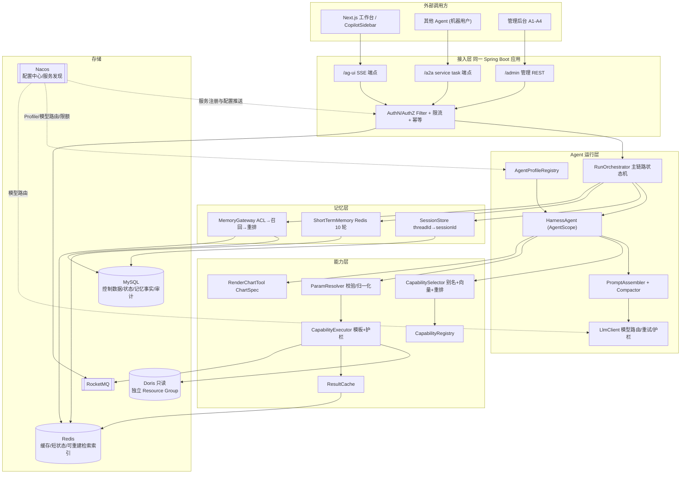

### 2.2 一次工作台提问的后端内部时序（含线程与超时）

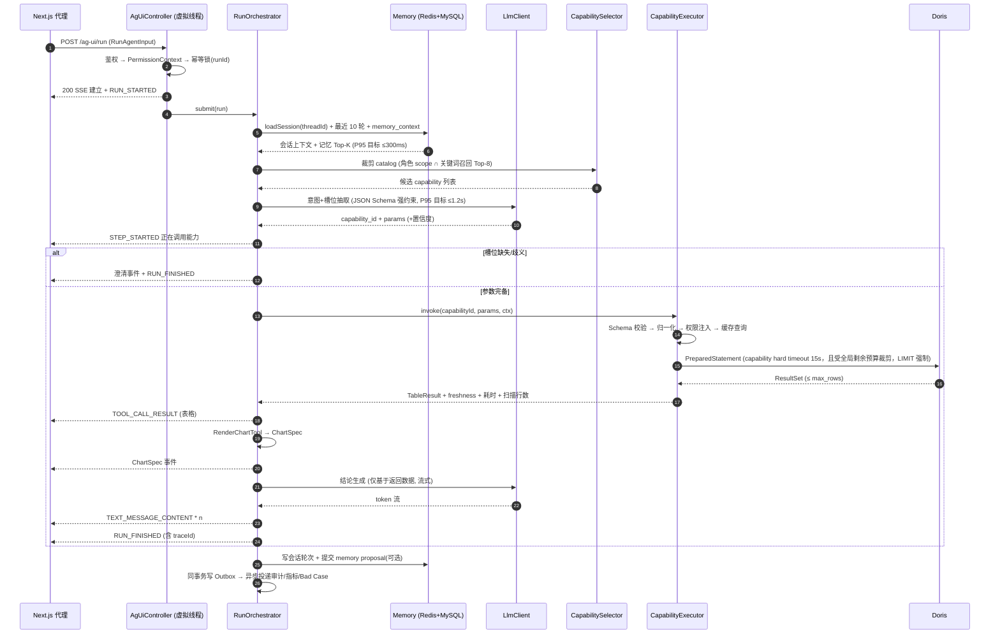

> [!warning] ⚠️
> **注意事件顺序**：表格结果必须在结论文本**之前**推给前端。前端三区共享同一份 `TOOL_CALL_RESULT`，如果先流文本后给数据，用户会看到「结论已出、表格还在转圈」，信任感直接崩掉。

### 2.3 线程与并发模型

| 通道 | 执行载体 | 并发上限 | 说明 |
| --- | --- | --- | --- |
| AG-UI 运行 | 虚拟线程 per run | 信号量 200（可配） | 超限直接返回「系统繁忙」而不是排队到超时 |
| Doris 查询 | 固定平台线程池 32 + 队列 64 | Bulkhead per capability | **刻意不用虚拟线程**：Doris 连接是稀缺资源，必须有明确闸门 |
| LLM 调用 | 虚拟线程 + Resilience4j TimeLimiter | 按模型分组限流 | 抽取用小模型、结论用主模型，配额分开 |
| A2A service task | 独立线程池与令牌桶；P2 可独立 Deployment | per-client + 全局配额 | 线程、连接池、LLM 配额与 Doris Bulkhead 均独立预算，避免机器流量挤占人的交互流量 |
| 审计 / 指标 / 记忆写入 | MySQL Outbox + MQ 异步消费 | — | 安全审计先持久化 Outbox；投递失败重试并告警，不依赖 Pod 本地磁盘 |

---

## 3. 工程结构

```javascript
iot-agent-backend/                     # Maven 多模块
├─ agent-bootstrap/                    # Spring Boot 启动 + 配置 + 装配
├─ agent-config-nacos/                 # Nacos DataId、动态配置白名单、服务注册与变更监听
├─ agent-api/                          # 对外 DTO / 事件定义 / 错误码（无业务依赖）
├─ agent-protocol-agui/                # AG-UI: Controller / SSE / 事件编码 / 重连
├─ agent-protocol-a2a/                 # A2A: 注册审批 / credential / discovery / task
├─ agent-runtime/                      # RunOrchestrator / HarnessAgent / Profile / Prompt / Compactor
├─ agent-llm/                          # LlmClient / 模型路由 / 结构化输出 / 护栏 / 打桩
├─ agent-capability/                   # Registry / Selector / ParamResolver / Executor / ChartSpec
│  └─ src/main/resources/capability/   # *.yaml 元数据 + *.sql 模板（Code Review 重点）
├─ agent-data-doris/                   # Doris 只读数据源 / JdbcTemplate / 查询护栏
├─ agent-persistence-mysql/            # MySQL Mapper / Repository / Flyway / Transactional Outbox
├─ agent-cache-redis/                  # Redis key、缓存、限流、锁、SSE 重放与检索索引适配
├─ agent-memory/                       # SessionStore / ShortTermMemory / MemoryGateway / 混合召回
├─ agent-admin/                        # 管理后台 REST：capability CRUD、审批、记忆治理、看板
├─ agent-observability/                # Trace/Metrics/审计事件/BadCase 采集
├─ agent-eval/                         # 离线评测跑批 + 报告生成（CI 调用）
└─ agent-common/                       # PermissionContext / 时间归一 / 错误 / 工具类
```

| 依赖红线（ArchUnit 强制） | 原因 |
| --- | --- |
| `agent-capability` 不得依赖 `agent-protocol-*` | 能力层必须能被人和机器两条链路平等复用 |
| `agent-protocol-agui` 与 `agent-protocol-a2a` 互不依赖 | 两套协议语义隔离，防止「省事复用」 |
| 只有 `agent-data-doris` 可以持有 Doris `JdbcTemplate/DataSource` | 分析查询只能从可审计的 capability 执行器进入 |
| 只有 `agent-persistence-mysql` 可以出现 MySQL Mapper/DO 与事务实现 | 其它模块只依赖 Repository SPI，避免 MySQL 表结构侵入 Agent、协议和能力层 |
| `agent-runtime` 不得直接 import AgentScope 具体实现类，只允许通过 `agent-runtime.spi` 包 | 框架升级/替换的隔离带 |
| `agent-llm` 不得依赖 `agent-data-doris` | 模型侧永远拿不到数据库句柄，物理上断掉自由 SQL 的可能 |

---

## 4. AG-UI 协议接入层

### 4.1 端点契约

| 方法 / 路径 | 作用 | 关键点 |
| --- | --- | --- |
| `POST /ag-ui/run` | 发起一次运行，返回 `text/event-stream` | 入参 `RunAgentInput`：`threadId`、`runId`、`messages`、`state`、`forwardedProps`（VIN / 车队 / 时区 / 宿主页上下文） |
| `POST /ag-ui/run/-runId-/cancel` | 取消运行 | 置取消标志 + 中断 Doris 语句 + 关闭 SSE，返回已产出内容，不回滚已完成的只读查询 |
| `GET /ag-ui/run/-runId-/replay` | 断线续传 | 依据 `Last-Event-ID` 从 Redis 事件缓冲（TTL 10min）重放，保证刷新页面不丢结果 |
| `POST /ag-ui/tool-result` | 前端参数微调 / 换图后的重跑 | **绕过 LLM**，直接 `capabilityId + params` 重放执行器；这是 PRD「参数微调不走模型」的后端入口 |
| `POST /ag-ui/feedback` | 👍👎 + 文本反馈 | 与 `traceId` 绑定入库，直接喂给 Bad Case 工作台 |

### 4.2 后端产出的事件（与前端 §8 契约一对一）

| 事件 | 触发时机 | 载荷要点 |
| --- | --- | --- |
| `RUN_STARTED` | SSE 建立后立即 | `runId`、`threadId`、`traceId`（前端展示于执行过程区） |
| `STEP_STARTED` / `STEP_FINISHED` | 状态机每个节点 | `stage` ∈ understand / resolve / invoke / render / conclude，供 StageIndicator |
| `TOOL_CALL_START` | 选中 capability 后 | `capabilityId`  • `**displayName**`（前端展示中文名，绝不暴露裸 id 给业务用户） |
| `TOOL_CALL_ARGS` | 参数确定后（增量） | 归一化**之后**的参数，含解析出的绝对时间区间 |
| `TOOL_CALL_RESULT` | 查询返回 | `columns`（含类型/单位/对齐）、`rows`、`rowCount`、`truncated`、`freshness`、`elapsedMs`、`scannedRows`、`sqlSnapshot`（脱敏） |
| `CHART_SPEC`（自定义） | RenderChartTool 后 | Vega-Lite spec + `chartAlternatives`（可切换类型白名单） |
| `TEXT_MESSAGE_CONTENT` | 结论生成（增量） | 纯 Markdown，禁止携带未在结果集出现的数值（见 §5.8） |
| `CLARIFY`（自定义） | 槽位缺失 / 多候选 | `question`  • `options[]`，每个 option **自带完整参数**，前端点击即重放，不走 LLM |
| `REFUSE`（自定义） | 能力未覆盖 / 超出 scope | `reason` 枚举 + `suggestedCapabilities`  • `requestCapabilityToken`（一键提交能力需求） |
| `RUN_ERROR` | 超时 / 数据源异常 | `failedStage`  • `retryable`  • `errorCode`；未完成的表格不得标记为成功，错误前已经完整发出的只读结果可保留 |
| `RUN_FINISHED` | 正常结束 | `followUps[]`（基于当前参数变形生成，本地模板生成，零 LLM 成本） |

### 4.3 SSE 实现要点

```java
@PostMapping(value = "/ag-ui/run", produces = MediaType.TEXT_EVENT_STREAM_VALUE)
public SseEmitter run(@RequestBody @Valid RunAgentInput input, Principal principal) {
    PermissionContext base = permissionResolver.resolve(principal); // 只信任已验证身份
    PermissionContext ctx = contextLimiter.intersect(base, input.forwardedProps()); // 上下文只能收窄权限
    SseEmitter emitter = new SseEmitter(Duration.ofMinutes(5).toMillis());

    AgUiEventSink sink = new BufferedEventSink(emitter, eventBuffer, input.runId());
    // 1) 立刻回 RUN_STARTED，避免前端白屏
    sink.emit(AgUiEvent.runStarted(input.runId(), Tracing.currentTraceId()));

    // 2) 心跳：15s 一次注释帧，穿透 Nginx/网关空闲超时
    heartbeat.register(emitter, Duration.ofSeconds(15));

    // 3) 真正的执行放到受限并发的虚拟线程上
    runExecutor.submit(input.runId(), () -> orchestrator.run(input, ctx, sink));

    emitter.onTimeout(() -> orchestrator.cancel(input.runId(), CancelReason.TIMEOUT));
    emitter.onError(e -> orchestrator.cancel(input.runId(), CancelReason.CLIENT_GONE));
    emitter.onCompletion(() -> runExecutor.release(input.runId()));
    return emitter;
}
```

- **事件缓冲与重放**：每个事件写 Redis List（`agui:run:{runId}:events`，TTL 10 分钟）并带自增 `id`，配合 `Last-Event-ID` 实现刷新/断网续传。
- **网关配置是必查项**：Nginx `proxy_buffering off`、`X-Accel-Buffering: no`、`Connection: keep-alive`，否则 SSE 会被缓冲成「一次性返回」，前端流式全部失效。
- **背压**：同时限制事件数（初始默认 2000）、单事件大小（128KB）与单次运行总字节数（5MB）；表格体积超过 200KB 时只传分页数据或 `resultRef`，阈值均需经压测校准。
- **幂等**：`runId` 做分布式锁 + 结果缓存，前端重试不会触发二次查询。

### 4.4 错误映射（前端 FailCard 直接消费）

| errorCode | 触发条件 | failedStage | retryable | 用户可见文案要点 |
| --- | --- | --- | --- | --- |
| `LLM_TIMEOUT` | 抽取或结论超时 | understand / conclude | 是 | 「理解你的问题时超时了」+ 重试 |
| `SCHEMA_INVALID` | 模型输出不符合 Schema（重试后仍失败） | understand | 是 | 降级为澄清气泡，让用户点选 |
| `PARAM_INVALID` | 时间跨度超上限 / 枚举非法 | resolve | 否 | 说明限制（如「最多查 90 天」）+ 给出可点的合法区间 |
| `SCOPE_DENIED` | capability 不在用户 scope | resolve | 否 | 拒答卡片 + 申请入口，**不暴露该能力的存在细节** |
| `DATA_TIMEOUT` | Doris 超过 `timeout_ms` | invoke | 是 | 「数据查询超时」+ 建议缩小时间范围（附一键缩短按钮） |
| `DATA_UNAVAILABLE` | 熔断打开 / 连接失败 | invoke | 是 | 「数据源暂不可用」+ 展示最近一次成功时间 |
| `RESULT_TRUNCATED` | 结果超 `max_rows` | —（成功态警告，不进入 `RUN_ERROR`） | 否 | 返回前 N 行并显式标记 `truncated=true`，附「导出完整明细」异步任务入口 |
| `CAPABILITY_NOT_FOUND` | 无候选或置信度过低 | understand | 否 | 拒答卡片 + 记入「未覆盖问题榜」 |

---

## 5. Agent 运行层

### 5.1 主链路状态机

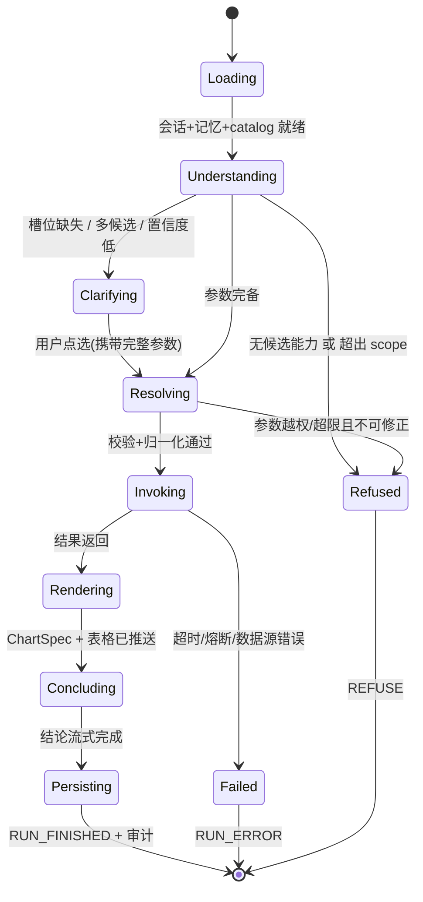

> [!note] 🔒
> **这张图就是「确定性主链路」的定义**：节点顺序由 Java 代码固定，LLM 只被允许在 `Understanding`（抽取）与 `Concluding`（措辞）两个节点参与。模型不能决定「要不要再查一次」「查哪张表」「先查后查」——多 capability 编排（L4 异常解释）用**预定义编排模板**，见 §5.9。

### 5.2 两个 Agent 的差异只在配置

```yaml
# agent-profiles/device-ops.yaml  （设备运营 Agent）
profile:
  id: device_ops
  display: 设备运营 Agent
  system_prompt_ref: prompts/device_ops.md
  capability_domains: [online, location, alarm, fault, trip, charge, geofence]
  orchestration_templates: [anomaly_explain, task_card]     # 允许多 capability 编排
  memory:
    read_org: true            # 可读组织记忆（车辆历史处置经验）
    write_proposal: true
  outputs: [text, table, chart, task_card, pdf]
  a2a_exposed: false          # P2 起且需强审批（有副作用）

# agent-profiles/data-base.yaml   （数据底座 Agent）
profile:
  id: data_base
  display: 数据底座 Agent
  system_prompt_ref: prompts/data_base.md
  capability_domains: [online, location, mileage, alarm, fault, charge, trip, geofence, schema]
  orchestration_templates: [single_query, compare_query]
  memory:
    read_org: false           # 主要用会话记忆
    write_proposal: false
  outputs: [text, table, chart]
  a2a_exposed: true           # P2 首批开放（只读，风险低）
```

新增一个 Agent 的成本 = 一份 yaml + 一份 prompt md + 一条评测子集。**不新增服务、不新增会话表、不复制 capability 目录**。

### 5.3 Prompt 组装与 token 预算

| 段 | 内容 | token 预算 | 超限策略 |
| --- | --- | --- | --- |
| System | 角色、红线（不得编造字段/数值、不得输出 SQL）、输出格式约定 | ≤ 800 | 固定，不裁剪 |
| Capability Catalog | **裁剪后的** Top-8 候选，每个只给 id / display / description / 参数 Schema / freshness | ≤ 1600 | 先降到 Top-5，再砍 description |
| 角色与权限上下文 | 用户可见车队、当前 VIN、时区、常用口径 | ≤ 200 | 固定 |
| memory_context | 组织记忆 Top-K（K ≤ 5，带来源与时间） | ≤ 900 | 按重排分数截断 |
| 会话历史 | 最近 10 轮（含上一次的 capability + 参数摘要，**不含完整结果集**） | ≤ 1500 | 触发 compaction（见 §5.7） |
| 当前问题 | 用户原文 | ≤ 300 | 超长截断并提示 |

> [!tip] 💡
> **会话历史里绝不能塞完整结果集**。一次 1000 行明细就能吃掉几万 token，是「上下文膨胀导致成本与延迟失控」这条风险最常见的翻车点。历史里只保留「问题 + capability + 参数 + 行数 + 关键结论 3 行」的摘要，需要原数据时按 `resultRef` 从缓存回捞。

### 5.4 槽位抽取与澄清判定

模型只输出一个受 JSON Schema 强约束的对象：

```json
{
  "capability_id": "alarm_count_by_type",
  "confidence": 0.86,
  "params": {
    "fleet_id": "F-1024",
    "time_range": { "expr": "近7天" }
  },
  "missing": [],
  "ambiguity": [],
  "alternatives": ["alarm_list"]
}
```

判定规则（**纯 Java 决策表，不交给模型自由决定**）：

| 条件 | 动作 |
| --- | --- |
| `confidence ≥ 0.75` 且 `missing` 为空 且必填参数齐全 | 直接执行 |
| `0.45 ≤ confidence \< 0.75` 或 `alternatives` 非空且分差 < 0.1 | 澄清：列出 2~3 个 capability 选项（用中文显示名 + 一句话说明） |
| 必填参数缺失（最常见：缺时间） | 澄清：给「今天 / 近 7 天 / 近 30 天」按钮，**每个按钮携带完整参数** |
| 车辆指代歧义（一个车牌命中多台 / 只给了「这台车」但无上下文） | 澄清：列出候选车辆（车牌 + VIN 后 6 位 + 车队） |
| `confidence \< 0.45` 或 `capability_id` 不在 catalog | 拒答 + 记入未覆盖问题榜 |
| 连续 2 轮澄清仍未收敛 | 兜底：给示例问题 + 转人工/提需求入口，**不再继续追问** |

### 5.5 时间归一化（准确率的第一杀手）

自然语言时间**不交给模型算绝对时间**，模型只输出表达式，Java 侧用 `TimeExpressionResolver` 解析：

| 输入表达式 | 解析结果（`Asia/Shanghai`，锚点 = 请求时刻） | 口径说明（必须回显给用户） |
| --- | --- | --- |
| 今天 | `[今日 00:00, 现在]` | 「当日累计，非完整自然日」 |
| 昨天 / 前天 | `[D-1 00:00, D-1 24:00)` | 完整自然日 |
| 近 7 天 | `[D-6 00:00, 现在]` | **含今天**；若业务口径为「不含今天」需在元数据里显式配置 |
| 上周 / 本周 | 周一为起点 | 回显具体日期区间，避免中外周起点分歧 |
| 本月 / 上月 | 自然月 | — |
| 那前天呢（多轮变形） | 继承上一轮 capability 与其它参数，仅替换 `time_range` | 这是 L6 多轮的核心路径，走 §5.6 的参数继承 |

所有归一化结果都通过 `TOOL_CALL_ARGS` 回显，前端在时效条旁展示「统计区间：08-15 00:00 ~ 08-21 15:51」。**用户能看到区间，才会信任数字。**

### 5.6 多轮参数继承与实体解析

```java
/** 上一轮的 capability 调用被保存为可继承的「查询意图」 */
record QueryIntent(String capabilityId, Map<String, Object> params,
                   Set<String> resolvedVins, String fleetId, Instant at) {}

/** 多轮变形：只覆盖模型明确提到的槽位，其余全部继承 */
QueryIntent inherit(QueryIntent prev, Extraction cur) {
    if (cur.capabilityId() == null && prev != null) {          // 「那前天呢」
        return prev.withParams(merge(prev.params(), cur.params()));
    }
    if (cur.mentionsSameVehicle() && prev != null) {           // 「还是刚才那台车」
        return new QueryIntent(cur.capabilityId(),
                merge(Map.of("vin_list", prev.resolvedVins()), cur.params()), ...);
    }
    return QueryIntent.of(cur);
}
```

**车辆实体解析** `VehicleResolver`：车牌 / VIN 全码 / VIN 后 6 位 / 自定义编号 / 「这台车」（来自 `forwardedProps`）→ 统一解析为 `vin_list`；解析必须**先过数据权限**，用户看不到的车辆直接视为不存在（而不是报「无权限」，避免探测式枚举）。

### 5.7 上下文压缩（compaction）

| 触发条件 | 动作 |
| --- | --- |
| 会话轮数 > 10 | 把第 1~N-10 轮合并为一段「会话摘要」（保留：涉及车辆、常用时间口径、已确认偏好、最后一次结论） |
| prompt token > 阈值的 80% | 依次执行：结果集摘要化 → 记忆 Top-K 降级 → catalog 降至 Top-5 → 历史摘要化 |
| 用户显式说「重新开始」 | 新建 `sessionId`，旧会话归档而非删除（审计需要） |

**压缩是压缩，不是截断丢弃**：被压缩的原始轮次仍留在 MySQL（`agent_session_message`），只是不进 prompt，Bad Case 复盘时可完整回放。

### 5.8 LLM 调用治理与幻觉护栏

| 治理项 | 做法 |
| --- | --- |
| 模型路由 | 抽取节点用小模型（快、便宜、结构化能力足够）；结论节点用主模型；两者配额与限流分开，抽取模型故障时可降级为「纯规则 + 澄清」 |
| 结构化输出 | 优先原生 Structured Outputs / 约束解码；根据本轮 Top-K capability 生成带 `capability_id` discriminator 的 `oneOf` Schema。JSON mode 仅作降级，返回后仍由同一份 Schema 二次校验 |
| 超时与重试 | 抽取：2.5s 超时，最多重试 1 次（第二次降温度、加「只输出 JSON」硬提示）；结论：8s，不重试（已有表格可展示） |
| 成本控制 | 按 `traceId` 记录 prompt/completion token 与费用，按用户/车队/Agent 维度出账；单次运行 token 上限熔断 |
| Prompt Caching | 稳定前缀固定为 system prompt + 输出契约 + 少量 few-shot；用户、时间、权限和候选 catalog 等动态内容统一放在后部，禁止把时间戳或随机 ID 塞进缓存前缀 |
| 采样参数 | 意图/槽位抽取默认 temperature 0~0.1；结论生成默认 0.2~0.3。具体值进入模型配置并通过评测集校准，不能硬编码在业务代码 |
| Prompt 版本化 | prompt 文件进 Git 并带版本号，`RUN_FINISHED` 与审计表记录 `promptVersion`  • `modelId`，评测报告可按版本对比 |

> [!note] 🧪
> **数值可信采用“证据账本优先、NumericGuard 兜底”**：Java 将查询单元格与同比、环比、占比等确定性派生值登记为 `FactLedger`（含 `factId`、原值、显示值、单位、表达式与来源列），结论模型只能引用这些 fact。`NumericGuard` 再处理千分位、百分比、单位换算、日期与标识符，发现无来源数字时删除或改写，并上报 `hallucination_suspect`。不能把简单字符串匹配当作 GA≈0 的充分证明，最终以评测集结果为准。

### 5.9 多 capability 编排：预定义模板（L4/L5 的实现方式）

异常解释需要多个 capability，但**绝不交给模型自由多跳**。编排写成可审核、可版本化的声明式模板，模型只能选择模板 id：

```yaml
# resources/orchestration/anomaly_explain.yaml
template:
  id: anomaly_explain
  display: 车辆异常解释
  input: { vin: required, time_range: default=近7天 }
  steps:
    - id: alarms                                  # 第一批：并行
      capability: alarm_list
      params: { vin_list: "${input.vin}", time_range: "${input.time_range}" }
      parallel_group: 1
      required: true                              # 失败则整个模板失败
    - id: alarm_stat
      capability: alarm_count_by_type
      parallel_group: 1
      required: true
    - id: faults
      capability: fault_list
      parallel_group: 1
      required: false                             # 失败只降级，不阻断
    - id: trips                                   # 第二批：依赖第一批结果
      capability: trip_list
      params: { time_range: "${steps.alarms.peak_window}" }
      parallel_group: 2
      required: false
  memory:
    recall_scope: [vehicle_ops_experience]        # 只召回车辆处置经验域
    top_k: 3
  output:
    primary_table: alarms
    chart: alarm_stat
    conclusion_prompt: prompts/anomaly_explain.md
  budget: { max_capabilities: 4, total_timeout_ms: 20000 }
```

| 编排约束 | 值 | 理由 |
| --- | --- | --- |
| 单模板 capability 上限 | 4 | 超过 4 次查询会显著放大尾延迟与部分失败；多能力模板使用独立 SLO，不套用单 capability 的 P95 目标 |
| 最大嵌套深度 | 2 批（parallel_group ≤ 2） | 保证延迟可预测，并行批内共享一个 Bulkhead |
| 部分失败 | `required: false` 的步骤失败 → 降级输出并在结论里声明「未能获取故障数据」 | 比整体报错强，但**必须显式告知缺什么** |
| 模板变更 | 进 Git + 版本号，上线前必须跑 L4 评测子集 | 编排是业务逻辑，不是提示词尝试 |

---

## 6. 能力层（本系统最核心的资产）

### 6.1 核心接口与模型 Schema

模型不直接看到 `Map<String,Object>`。`CapabilitySchemaCompiler` 根据本轮 Top-K 候选生成带 discriminator 的 `oneOf` Schema；LLM 只负责产出 `CapabilitySelection`，内部执行入口再把通过校验的 JSON 转成强类型参数。

```java
/** LLM 结构化输出；Schema 中不存在 sql 字段 */
public record CapabilitySelection(
        String capabilityId,
        JsonNode params,
        double confidence,
        List<String> missing,
        List<String> alternatives
) {}

public interface CapabilitySchemaCompiler {
    JsonSchema compileOneOf(List<CapabilityDescriptor> candidates);
}

/** 仅供运行时内部调用，不把泛型 Map 作为模型工具 Schema */
public interface CapabilityInvoker {
    TableResult invoke(CapabilitySelection selection, PermissionContext permission);
}

public interface Capability<P> {
    CapabilityDescriptor descriptor();
    Class<P> parameterType();
    /** request 已完成校验、归一化与权限注入，实现类不得再解释用户原文 */
    TableResult execute(CapabilityRequest<P> request);
}

public record CapabilityRequest<P>(
        String capabilityId,
        P params,
        PermissionContext permission,
        ExecutionOptions options
) {}

public record TableResult(
        List<ColumnMeta> columns,
        List<Object[]> rows,
        int rowCount,
        boolean truncated,
        Freshness freshness,
        FactLedger facts,
        ExecStats stats
) {}
```

- **单一事实源**：模型 Schema、Java 校验器、管理后台表单和评测参数格式均由同一份 capability 元数据生成。
- **失败关闭**：`capability_id` 不在本轮候选、discriminator 与 params Schema 不一致、或反序列化失败时，不进入执行器。
- **框架隔离**：AgentScope 的 function calling 只是适配层；更换模型或框架不改变 `CapabilitySchemaCompiler` 与 `CapabilityInvoker`。

### 6.2 capability 元数据字段（PRD §5.3 的完整形态）

| 字段 | 类型 | 用途与约束 |
| --- | --- | --- |
| `id` / `display` / `description` | string | `id` 不可变（审计与评测集引用）；`display` 给人看；`description` 给模型看 |
| `aliases` | string[] | 召回准确率的主力。由 Bad Case 持续回灌，支持同义词、缩写、错别字、行业黑话 |
| `domain` | enum | catalog 裁剪与 Agent profile 授权的粒度 |
| `readonly` | bool | `false` 的能力默认**不可** A2A 开放，且需双人审批 |
| `params[]` | object[] | `name` / `type` / `required` / `enum_ref` / `max_span_days` / `max_items` / `default`；自动生成 JSON Schema |
| `returns.shape` / `returns.columns` | object | 列的语义类型（time / category / metric / geo / id）、单位、小数位，直接决定图表与表格渲染 |
| `chart_hint` | enum | ChartSpec 默认类型的强提示，可被列结构推导覆盖 |
| `source_tables[]` | string[] | **新增字段**：声明依赖的 Doris 表，用于运行时获取真实 ETL 水位与表级血缘影响分析 |
| `freshness_policy` | object | `type` ∈ realtime / t_plus_0 / t_plus_1；`expected_delay_min`；运行时与实际水位对比，偏离超阈则在时效条告警 |
| `limits` | object | `max_rows` / `timeout_ms` / `max_span_days` / `max_qps_per_user` |
| `cache` | object | `ttl_seconds` / `cacheable`；实时类能力 TTL 可为 60s，日聚合类可到 900s |
| `scopes[]` | string[] | 与 A2A scope、用户角色权限共用同一套命名（如 `vehicle.alarm.read`） |
| `row_filter_policy` | enum | **安全关键**：声明该能力的行级权限注入方式（`by_fleet` / `by_vin` / `by_org`），缺失则**注册失败** |
| `sample_questions[]` | string[] | 双用：向量召回的语料 + 前端空状态示例问题 |
| `owner` / `status` / `version` | string | `status` ∈ draft / staging / online / deprecated；变更自动递增 version 并触发回归 |

### 6.3 capability 选择：三路召回 + 重排

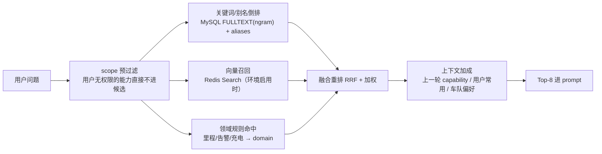

> [!tip] 💡
> **scope 预过滤必须在最前面**。如果先召回再滤权限，会出现两个问题：Top-8 被无权限能力占满导致准确率下降；以及模型可能在拒答文案里泄露「存在某个你看不到的能力」。这与 §8 的记忆 ACL 预过滤是同一个原则。

### 6.4 参数解析管线（八步，顺序不可变）

| # | 步骤 | 失败行为 |
| --- | --- | --- |
| 1 | **未知参数剔除（严格模式）**——模型传了 Schema 外的 key 直接报错，而不是静默忽略 | `SCHEMA_INVALID`（防止「偷渡参数」式注入尝试） |
| 2 | JSON Schema 类型与必填校验 | 缺必填 → 澄清；类型错 → 重试一次抽取 |
| 3 | 时间表达式解析（§5.5）→ 绝对区间 | 无法解析 → 澄清并给按钮 |
| 4 | 实体解析：车牌/VIN/车队名 → 内部 ID | 多命中 → 澄清；零命中 → 「未找到该车辆」 |
| 5 | 枚举与字典校验（告警类型、故障码、车型来自字典表） | `PARAM_INVALID`  • 列出合法值 |
| 6 | 上限约束：`max_span_days`、`vin_list` 长度、TopN 上限 | `PARAM_INVALID`  • 提供一键缩短选项 |
| 7 | **权限注入**：根据 `row_filter_policy` 强制注入 `acl_fleet_ids` / `acl_vins`，模型**无法**传入或覆盖这些参数 | 注入失败 → 直接报错，绝不降级为无过滤查询 |
| 8 | 参数指纹（排序归一化 → sha256），用于缓存 key 与幂等 | — |

> [!note] 🔒
> 第 7 步是整个系统的权限命门：**ACL 参数与业务参数在类型上就是两个集合**。`params` 只能装业务参数，`PermissionContext` 只能由服务端鉴权产生。SQL 模板中的 ACL 占位符如果没被注入，模板渲染直接抛异常——宁可报错，不可少一个过滤条件。

### 6.5 执行器护栏

| 护栏 | 生效时机 | 实现 |
| --- | --- | --- |
| 必须命中分区键 | **模板注册时静态校验**（启动即 fail-fast） | 解析 SQL 模板 AST，确认 `WHERE` 包含分区列范围条件 |
| 必须带 `LIMIT` 且 ≤ `max_rows` | 注册时 + 执行时 | 执行前强制重写 LIMIT，取 `min(模板值, max_rows)` |
| 禁止 `SELECT *` | 注册时 | 列必须与 `returns.columns` 一一对应，否则前端渲染与单位会错位 |
| 参数化执行 | 执行时 | 仅 `PreparedStatement`；`IN` 列表由框架展开为等量 `?` 占位符，数量受 `max_items` 限制 |
| 超时与中断 | 执行时 | `Statement.setQueryTimeout`  • 会话变量 `query_timeout`；取消时 `Statement.cancel()` |
| 内存上限 | 执行时 | 连接初始化设 `exec_mem_limit`，避免单查询打爆 BE |
| 熔断与隔离 | 执行时 | per-capability CircuitBreaker（失败率 50% / 20 请求窗口）+ Bulkhead |
| 结果截断可见 | 返回时 | `truncated=true` 必须上接前端提示，**绝不静默截断**（静默截断等于给错数） |

### 6.6 结果缓存

```java
String cacheKey = sha256(String.join("|",
        permission.tenantId(),
        capabilityId,
        descriptor.version(),              // capability 变更自动失效
        normalizedParamsFingerprint,       // 第 8 步的参数指纹
        permission.fingerprint(),          // 主体 + 车队/VIN 集合 + role/scope
        permission.dataPolicyVersion(),    // 列脱敏与行级策略变更自动失效
        freshnessBucket(descriptor)));     // T+0 按 5 分钟桶，T+1 按天桶
```

| 规则 | 说明 |
| --- | --- |
| **tenant + 权限指纹 + 数据策略版本必须进 key** | 否则不仅可能串车队，还可能在脱敏策略变更后命中旧的未脱敏结果；每次请求都重新从可信身份系统计算有效权限 |
| L1 Caffeine 30s + L2 Redis `ttl_seconds` | L1 抖动吹平，L2 跳副本共享 |
| 命中缓存仍返回真实时效 | `freshness` 取自缓存快照时刻，前端展示「数据截至 15:02」而不是当前时间 |
| 大结果不进缓存体 | > 200KB 只缓 `resultRef`，本体落对象存储（供导出与参数微调回捞） |
| 主动失效 | capability 上下线 / 字典变更 / ETL 补传修正事件（MQ）→ 按 `source_tables` 批量清缓存 |

### 6.7 RenderChartTool 与 ChartSpec

后端**只出 spec、不出图片**，决策顺序：`chart_hint` → 列语义类型推导 → 行数/基数修正。

```json
{
  "chartType": "bar",
  "spec": {
    "$schema": "https://vega.github.io/schema/vega-lite/v5.json",
    "data": { "name": "result" },
    "mark": "bar",
    "encoding": {
      "x": { "field": "alarm_type", "type": "nominal", "sort": "-y", "title": "告警类型" },
      "y": { "field": "alarm_count", "type": "quantitative", "title": "告警次数（次）" }
    }
  },
  "chartAlternatives": ["table", "pie", "line"],
  "dataRef": "result:9f2a...",
  "notes": ["统计区间 2026-08-15 00:00 \u007e 2026-08-21 15:51", "数据截至 15:02，延迟约 5 分钟"]
}
```

| 列结构 | 默认 chartType | 修正规则 |
| --- | --- | --- |
| 1 metric，0 维度 | `metric_card` | 自动追加环比（若 capability 支持同参数上一周期查询） |
| 1 metric + 1 category | `bar` | 类别 > 20 → Top 20 + 「其他」归并，并在 notes 声明 |
| 1 metric + 1 time | `line` | 点数 < 3 降级为 `bar`；点数 > 400 自动降采样并注明粒度 |
| metric + time + category | `multi_line` / `stacked_bar` | 系列 > 8 → 取 Top 8 系列，余下归「其他」 |
| 含 lat/lng 或 geohash | `map` | 输出轨迹/散点两种，交给前端 deck.gl |
| 明细多列 | `table` | 不强行出图；明细场景强制图表只会制造干扰 |

前端切图走 `chartAlternatives` 白名单 + `dataRef`，**不重新请求模型、不重新查数据**。

### 6.8 capability 生命周期与变更治理

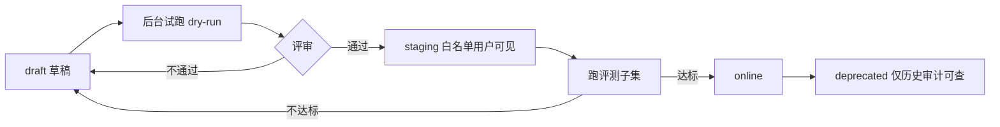

- **试跑（dry-run）**：管理后台可传参数执行一次，返回真实 SQL、行数、耗时、扫描量；**试跑也走审计**。
- **变更影响分析**：修改 `params` 或 `returns` 为不兼容变更，必须递增主版本并保留旧版本一个版本周期（A2A 调用方可能已绑定）。
- **下线保护**：若该 capability 已被任何 A2A grant 引用，下线需先通知调用方并进入 30 天 deprecated 期。

---

## 7. 数据访问层（Doris）

### 7.1 连接与资源隔离

| 项 | 配置 | 理由 |
| --- | --- | --- |
| 账号 | `agent_ro`，仅 `SELECT`，仅授权到具体库/表 | 从数据库层面彻底消除写风险 |
| Resource Group | 独立 `rg_agent`，CPU 与内存硬隔离 | **避免打爆生产报表**（PRD §9.1） |
| 连接池 | HikariCP max 32 / min 8 / `connectionTimeout` 3s / `validationTimeout` 1s | 与 Doris 线程池 32 对齐，不制造排队假象 |
| 会话参数 | `query_timeout=20` 作为 Doris 会话最大值，并继续受请求剩余 deadline 裁剪；`exec_mem_limit=2G`；`enable_profile=false`（只在采样排查时开） | 单查询不能拖垮整个 BE |
| 只读副本 | 有条件时优先路由到查询副本/只读集群 | P1 优先级；写入高峰时查询延迟波动是真实风险 |

**双 DataSource 强隔离**：`controlDataSource` 连接 MySQL 控制库并允许业务事务；`analyticsDataSource` 只连 Doris 只读账号。两者使用不同配置前缀、连接池、Mapper 扫描路径与 Micrometer tag，注入时强制 `@Qualifier`；禁止跨 MySQL/Doris 的本地事务假设。

### 7.2 SQL 模板示例（带强制 ACL 占位符）

```sql
-- resources/capability/alarm_count_by_type.sql
-- 模板作者必须写出 acl 占位符，否则注册阶段直接 fail-fast
SELECT alarm_type,
       COUNT(1) AS alarm_count
FROM dws_vehicle_alarm_di
WHERE stat_date >= ?                      -- 分区键（静态校验必须命中）
  AND stat_date <  ?
  AND (? IS NULL OR fleet_id = ?)          -- 业务参数 fleet_id
  AND (${vin_list_empty} OR vin IN (${vin_list}))
  AND fleet_id IN (${acl_fleet_ids})       -- 权限谓词：由框架注入，模板不可省
GROUP BY alarm_type
ORDER BY alarm_count DESC
LIMIT 1000                                 -- 执行时会被重写为 min(1000, max_rows)
```

`${...}` 不是字符串拼接：框架将其展开为等量 `?` 占位符并按顺序绑定参数，展开个数受 `max_items` 限制。展开器是全局唯一入口，并有专项单测（含注入字串用例）。

### 7.3 数据时效（freshness）的真实来源

> [!note] 🕐
> **不要把时效写成静态文案**。`freshness: T+0（延迟约 5 分钟）` 只是期望值；真实值必须来自数仓的 ETL 水位表。否则一旦 ETL 延迟 2 小时，产品会让用户基于陈数据做决策，**信任一次就没了**。

- 数仓侧维护 `dw_table_watermark(table_name, max_event_time, etl_finish_time, status)`。
- capability 执行后，根据 `source_tables` 取最小水位作为本次结果的 `freshness.dataAsOf`。
- 实际延迟 > `expected_delay_min` 的 2 倍：结果仍返回，但附 `freshness.warning`，前端时效条变黄并提示「数据延迟高于预期」。
- 收到补传/修正事件（MQ）：清理相关缓存 + 为受影响日期打上「已修正」标记，前端展示「⚠️ 昨日数据已修正」。

### 7.4 慢查询、降级与异步导出

| 场景 | 阈值 | 处理 |
| --- | --- | --- |
| 慢查询 | > 3s | 记录 SQL 指纹 + 参数 + 扫描行数到慢查询表，进每日优化清单 |
| 极慢查询 | > 10s | 告警 + 自动建议（缺日聚合表 / 分区未命中 / 缺前缀索引） |
| 熔断打开 | 失败率 50% | 此 capability 返回 `DATA_UNAVAILABLE`；**如有未过期缓存则返回缓存并明确标注旧数据时间** |
| 结果超 `max_rows` | 如 1000 | 返回前 1000 行 + `truncated`  • 异步导出任务 token |
| 异步导出 | — | MQ 任务 → 分页拉取写 CSV/XLSX → 对象存储 + 预签名链接（有效期 2h）→ 站内通知；**导出同样写审计与行数** |

---

## 8. 记忆层

### 8.1 四层结构与职责

| 层 | 存储 | 内容 | 生命周期 / 一致性 |
| --- | --- | --- | --- |
| 会话短记忆 | Redis | 最近 10 轮消息摘要 + 上一个 `QueryIntent` | TTL 24h；丢失后可由 MySQL 消息重建 |
| 会话持久化 | MySQL（本地开发可用文件实现） | `threadId → sessionId`、完整轮次、Agent 状态快照 | 事实库；归档与保留期按数据策略执行 |
| 组织长记忆 | MySQL | 正文、ACL、来源证据、版本、失效时间、embedding 原始值/模型版本 | 事实库；proposal 审核后生效 |
| 检索索引 | Redis Stack / RediSearch（可选能力） | 可过滤 TAG、全文字段、向量、`source_version` | 派生数据；由 MySQL Outbox 异步同步，可清空重建 |

> [!note] 🗄️
> **MySQL 是唯一事实库，Redis 永远不是长记忆真相来源。** Redis Search 只负责快速召回候选；候选返回给模型前必须回 MySQL 校验 tenant、状态、有效期和 ACL。这样即使索引延迟或误配置，最多影响召回率，不能造成数据越权。

### 8.2 会话持久化（跳副本恢复 ≥ 99%）

```java
public interface AgentStateStore {
    Optional<AgentState> load(String sessionId);
    /** 乐观锁：version 不匹配抛 StaleStateException，避免多副本并发覆写 */
    void save(String sessionId, AgentState state, long expectedVersion);
    String resolveSessionId(String threadId, String userId, String profileId);
}
```

| 要点 | 做法 |
| --- | --- |
| 映射关系 | `(threadId, userId, profileId)` 唯一确定一个 `sessionId`；切换车队上下文视为新会话（权限上下文不能沿用） |
| 写时机 | 每轮结束写一次（含失败轮次，便于复盘）；写入异常不阻断已返回给用户的结果 |
| 恢复 | 副本重启/漂移后按 `threadId` 重新 load；若快照版本不兼容则降级为「仅用消息历史重建」 |
| 本地开发 → P0 环境 | local profile 可使用文件实现；进入共享联调环境前直接切到 MySQL。若已有文件态数据，仅做一次性导入，不在生产链路长期双写 |

### 8.3 Redis 短记忆 key 设计

```javascript
sess:{sessionId}:turns      LIST   最近 10 轮摘要（LPUSH + LTRIM 0 9）  TTL 24h
sess:{sessionId}:intent     STRING 上一个 QueryIntent（JSON）              TTL 24h
sess:{sessionId}:result:{n} STRING resultRef → 结果快照引用             TTL 30m
agui:run:{runId}:events     LIST   SSE 事件缓冲（断线续传）              TTL 10m
cap:result:{cacheKey}       STRING capability 结果缓存                    TTL 按元数据
rl:user:{userId}:{capId}    ZSET   滑动窗口限流
lock:run:{runId}            STRING 幂等锁                                TTL 5m
mem:index:version            STRING Redis Search 索引全局版本/重建水位       无 TTL
mem:tombstone:{memoryId}     STRING 已失效记忆的短期拒绝标记                 TTL 24h
```

### 8.4 MemoryGateway 接口与四类权限

```java
public interface MemoryGateway {
    /** 召回：PermissionContext 是第一个参数且不可为 null——ACL 预过滤写进签名 */
    RecallResult recall(PermissionContext ctx, RecallQuery query);

    /** 服务调用方（A2A）唯一入口：只能读显式传入的引用，不允许模糊召回 */
    List<MemoryItem> loadExplicit(PermissionContext ctx, List<String> memoryRefs);

    /** 写入只能提议，不能直插 */
    MemoryProposal propose(PermissionContext ctx, MemoryDraft draft);

    void deleteOwn(PermissionContext ctx, String memoryId);
}
```

| 权限 | 含义 | 授予对象 |
| --- | --- | --- |
| `memory.read.explicit` | 只读显式传入的 `memory_refs` | **所有 A2A service agent 仅此一项** |
| `memory.read.org` | 在 ACL 范围内做组织级模糊召回 | 人类用户 + 设备运营 Agent |
| `memory.write.proposal` | 提交写入建议（待审） | 设备运营 Agent、运营用户 |
| `memory.delete.own` | 删除自己提交/归属的记忆 | 人类用户（Agent 无此权） |

### 8.5 MySQL ACL 事实 + Redis Search 混合召回

Redis 索引文档仅保存召回所需字段：`memory_id`、`tenant_id`、`scope_type`、`status`、`expire_at`、`acl_tokens[]`、`content_index`、`embedding`、`source_version`。查询由服务端 Builder 生成并转义 TAG，不接受模型或用户传入原始查询语法：

```plain text
FT.SEARCH idx:memory
  '(@tenant_id:{T1} @status:{ACTIVE} @scope_type:{vehicle_ops}
    (@acl_tokens:{user:u1}|@acl_tokens:{role:operator}|@acl_tokens:{fleet:F1024}))
    =>[KNN 50 @embedding $query_vector AS distance]'
  PARAMS 2 query_vector <binary>
  DIALECT 2
```

1. `PermissionContext` 生成 tenant、scope 和 principal token，先作为 Redis TAG 过滤条件，再做 KNN/全文召回。
2. 向量候选与关键词候选在 Java 用 RRF 融合，只保留有界候选集（初始 50）。
3. 候选 ID **必须回 MySQL 二次验权**，只返回仍为 ACTIVE、未过期且 ACL 命中的正文：

```sql
SELECT m.id, m.content, m.updated_at, m.source_version
FROM memory_item m
WHERE m.tenant_id = ?
  AND m.status = 'ACTIVE'
  AND (m.expire_at IS NULL OR m.expire_at > CURRENT_TIMESTAMP(3))
  AND m.id IN (?, ?, ...)
  AND EXISTS (
      SELECT 1
      FROM memory_acl a
      WHERE a.memory_id = m.id
        AND a.tenant_id = m.tenant_id
        AND a.principal_token IN (?, ?, ...)
  );
```

不在 Java 内对全量 embedding 做暴力余弦扫描。使用 MySQL InnoDB `FULLTEXT ... WITH PARSER ngram`、`aliases` 和领域规则召回，且 ACL 与 tenant 条件必须出现在同一查询中；语义向量召回延期到基础设施具备 RediSearch 后再开启。

```sql
SELECT m.id,
       MATCH(m.content_index) AGAINST (? IN BOOLEAN MODE) AS text_score
FROM memory_item m
WHERE m.tenant_id = ?
  AND m.status = 'ACTIVE'
  AND (m.expire_at IS NULL OR m.expire_at > CURRENT_TIMESTAMP(3))
  AND MATCH(m.content_index) AGAINST (? IN BOOLEAN MODE)
  AND EXISTS (
      SELECT 1 FROM memory_acl a
      WHERE a.memory_id = m.id
        AND a.tenant_id = m.tenant_id
        AND a.principal_token IN (?, ?, ...)
  )
ORDER BY text_score DESC, m.updated_at DESC
LIMIT ?;
```

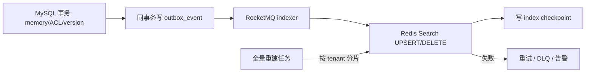

- MySQL 行使用单调递增 `source_version`；Indexer 只接受新版本，重复/乱序消息幂等。
- 记忆失效或 ACL 收窄先提交 MySQL，并写短期 tombstone；即使 Redis 尚未删除，MySQL 二次验权仍会拒绝。
- Redis 索引可按 tenant 分片全量重建；重建期间使用双索引别名原子切换，不能停掉 ACL 校验。
- Redis 按用途拆资源池：幂等/锁/事件状态使用 `noeviction`，结果缓存可用 LRU，RediSearch 索引独立评估内存，避免缓存淘汰影响锁和任务状态。

> [!note] 🔐
> **安全不依赖 Redis 索引及时一致。** 索引 ACL 用于减少无权候选和控制成本，MySQL 二次验权才是最终允许读取正文的权威判断；任何异常都 fail closed。

- **上线前基准**：按 10 万 / 100 万 / 1000 万记忆量测试 P50/P95、Recall@K、nDCG、索引延迟、重建时长和 ACL 泄漏率；没有实测前不承诺 Top-K 延迟。

### 8.6 记忆写入：proposal 机制

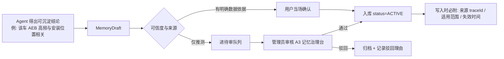

- **每条记忆必须可溯源**：`source_trace_id`、`proposed_by`、`approved_by`、`evidence`（当时的 capability + 参数 + 关键数值）。
- **必附适用范围**：车辆级 / 车型级 / 车队级 / 全局；默认取**最窄**范围，避免把个例结论固化成「组织常识」。
- **必附失效时间**：默认 180 天，到期进复审队列（车辆状况会变，陈旧经验比没经验更危险）。
- **冲突检测**：新 proposal 与已有记忆相似度 > 0.9 但结论相反 → 强制进人工审核并展示差异。

### 8.7 人类会话与 A2A 调用方的记忆约束

| 项 | 人类会话 | A2A service task |
| --- | --- | --- |
| 会话短记忆 | 有（`threadId` 维度） | 默认无；仅保存 task 自身状态，不跨 task 自动继承 |
| 组织记忆模糊召回 | 有（需 `memory.read.org`） | 禁止 |
| 显式记忆引用 | 可选 | 仅允许调用方传入已授权的 `memory_refs`，逐条校验 `memory.read.explicit` |
| 记忆写入 | 可提 proposal | 禁止直接写；若未来开放，只能创建待人工审核的 proposal |
| 原因 | 人可以识别异常召回并反馈 | 机器高频调用会放大模糊召回与数据外泄风险，因此默认无状态、显式授权、最小可见 |

---

## 9. A2A 控制面与服务任务

> [!note] 🧱
> **A2A 不是把 AG-UI 换一个 URL**。它面对的是机器主体、长期凭据、异步任务和稳定版本契约；必须独立鉴权、独立配额、持久化任务状态，并且默认只开放只读 capability。

### 9.1 接口契约

| 方法 / 路径 | 作用 | 关键约束 |
| --- | --- | --- |
| `POST /a2a/registrations` | 调用方提交接入申请 | 用途、负责人、预计 QPS、数据范围、回调地址；仅创建待审记录，不立即发凭据 |
| `GET /a2a/discovery` | 发现可调用能力 | 只返回当前 client grant 内、状态为 online 的 capability 版本 |
| `POST /a2a/tasks` | 提交 service task | 携带 `clientRequestId` 幂等键、固定 capability/version、参数与可选 `memory_refs`；返回 `202 + taskId` |
| `GET /a2a/tasks/-taskId-` | 查询任务状态与结果 | 只允许创建该任务的 client 或授权管理员读取；结果带 `resultRef`、freshness 与审计号 |
| `POST /a2a/tasks/-taskId-/cancel` | 取消未完成任务 | 幂等；已完成任务返回最终状态，不回滚已完成的只读查询 |
| `POST callbackUrl` | 任务完成回调 | 事件带 `eventId`、时间戳和签名；指数退避重试，达到上限进入死信并允许调用方轮询补偿 |

### 9.2 任务状态机与持久化

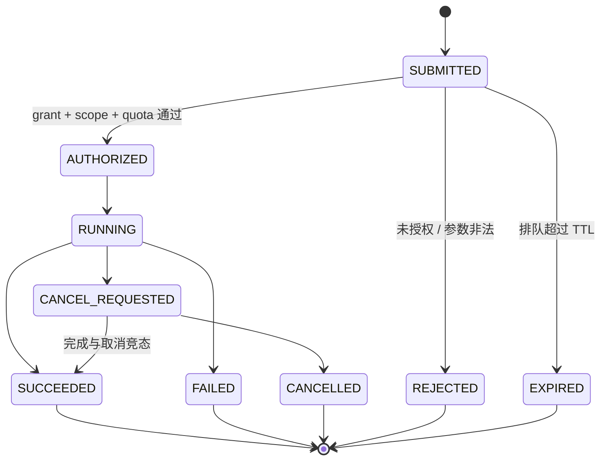

- `a2a_task` 在返回 `202` 前落 MySQL，任务状态使用乐观锁和合法状态迁移表校验。
- 每个状态变化与 `outbox_event` 同事务写入；worker 至少一次消费，靠 `taskId + stepId` 去重。
- **SSE 重放不等于执行恢复**：A2A worker 每个确定性步骤写 checkpoint，Pod 重启后从最后一个成功步骤继续。
- `clientRequestId` 在 client 维度唯一；重复提交返回原 `taskId`，不得二次查询 Doris。

### 9.3 鉴权、授权与凭据

```java
EffectiveGrant effective = intersect(
        clientGrant,
        capability.requiredScopes());
if (delegatedSubjectGrant.isPresent()) {
    effective = intersect(effective, delegatedSubjectGrant.get());
}
```

- 首选 OAuth2 Client Credentials 短期访问令牌；网关条件允许时叠加 mTLS。长期 secret 只存哈希，创建时仅展示一次。
- `forwardedProps`、callback body 和模型输出均不得生成 scope；有效权限由服务端 grant 计算。
- 使用被代理用户身份时必须携带可验证 subject token，最终权限取 client 与 subject 的交集。
- credential 支持到期、轮换、吊销和最后使用时间；吊销后新请求立即拒绝，运行中任务按风险策略取消或完成只读步骤。

### 9.4 资源隔离

| 资源 | AG-UI | A2A |
| --- | --- | --- |
| 线程 / 队列 | 低排队、面向交互 | 独立 worker 与有界队列 |
| Doris | 交互 Resource Group / 连接池 | 独立 Bulkhead；P2 可独立连接池与 Resource Group |
| LLM 配额 | 优先级高 | client 级 RPM/TPM + 全局预算 |
| 部署 | 主 Deployment | 流量达到阈值后用同一制品拆独立 Deployment |

---

## 10. 管理后台、MySQL 控制面与 Nacos 配置治理

### 10.1 A1–A4 后端职责

| 后台 | 核心能力 | 发布/审批要求 |
| --- | --- | --- |
| A1 Capability 管理 | 元数据、Schema、SQL 模板、别名、限额、dry-run、版本发布与下线 | SQL/ACL 静态检查 + 评测子集 + owner 审批；不兼容变更升主版本 |
| A2 A2A 授权 | client 注册、grant、scope、credential 轮换、配额与吊销 | 只读轻审批；写 capability 双人审批并限定有效期 |
| A3 记忆治理 | proposal 审核、ACL、冲突、失效、删除与复审 | 扩大全局/组织可见范围必须二次确认并记录差异 |
| A4 效果与审计 | SLO、成功率、成本、未覆盖问题、Bad Case、审计检索与导出 | 审计导出本身也需权限和审计，默认脱敏 |

### 10.2 管理 API

| 领域 | 主要端点 | 约束 |
| --- | --- | --- |
| A1 Capability | `GET/POST /admin/capabilities`、`POST /admin/capability-versions/:id/dry-run`、`POST /admin/capability-versions/:id/publish` | 编辑与发布权限分离；publish 必须携带评测运行号与审批版本 |
| A2 A2A | `GET /admin/a2a/registrations`、`POST /admin/a2a/clients/:id/grants`、`POST /admin/a2a/credentials/:id/rotate`、`POST /admin/a2a/clients/:id/revoke` | secret 只在创建/轮换成功时显示一次；授权、轮换和吊销全部强审计 |
| A3 Memory | `GET /admin/memory-proposals`、`POST /admin/memory-proposals/:id/approve|reject`、`POST /admin/memories/:id/invalidate` | 审核者不能审批自己提交的组织/全局 proposal；扩大 scope 需二次确认 |
| A4 效果与审计 | `POST /admin/eval-runs`、`GET /admin/bad-cases`、`GET /admin/audit-events`、`POST /admin/audit-exports` | 按 tenant 与角色过滤；审计导出走异步任务与下载权限复核 |

### 10.3 核心表与所有权

| 领域 | 核心表 | 关键约束 |
| --- | --- | --- |
| Capability | `capability_definition`、`capability_version`、`capability_release` | `id` 不变、版本不可变；online 指针单独维护，发布可原子回滚 |
| A2A | `a2a_client`、`a2a_grant`、`a2a_credential`、`a2a_task`、`a2a_task_step` | tenant 隔离；secret 不落明文；task 状态机受约束 |
| Session | `agent_session`、`agent_session_message`、`agent_run_checkpoint` | 完整消息与 prompt 快照分开存；敏感正文加密并设保留期 |
| Memory | `memory_item`、`memory_acl`、`memory_proposal`、`memory_review`、`memory_index_checkpoint` | 来源、适用范围、失效时间、审核链和 `source_version` 不可缺失；Redis 索引可由这些表重建 |
| 评测 | `eval_dataset`、`eval_case`、`eval_run`、`eval_case_result` | 数据集与运行快照不可变；记录 prompt/model/capability 版本 |
| 审计 | `audit_event`、`outbox_event`、`bad_case` | append-only；`event_id` 全局唯一；按月分区与保留策略归档 |

MySQL 表设计统一约束：

- 多租户业务表必须包含 `tenant_id`，唯一键和常用索引以 `tenant_id` 为前导列；Repository 禁止无 tenant 条件的列表查询。
- 时间统一存 UTC `DATETIME(3)`，API 层按用户时区转换；状态迁移使用 `version` 乐观锁。
- 频繁过滤字段使用普通列，JSON 只保存不可变快照/扩展信息，禁止把授权条件埋入无法索引的 JSON。
- `iot_agent` 业务 schema、Nacos 基础设施 schema 与 Doris 数据源使用独立账号和连接池，禁止跨库 join 与分布式事务幻觉。

### 10.4 Capability 发布事务

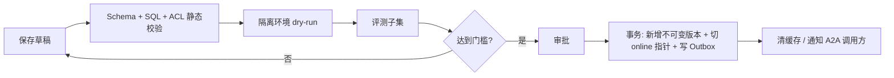

- 发布使用 `If-Match/version` 乐观锁，防止两名管理员互相覆盖。
- dry-run 使用受限数据集与只读账号，返回 SQL 指纹而不是在普通日志打印完整敏感参数。
- 下线前检查活跃 grant；deprecated 期内固定旧版本可调用，但 discovery 不再推荐。

### 10.5 MySQL Transactional Outbox

安全审计、grant 变更、写操作、导出创建和 Redis 索引同步等关键状态与 `outbox_event` 在同一个 MySQL 本地事务提交。

- Relay 用 `SELECT ... FOR UPDATE SKIP LOCKED` 分批抢占待投递事件，多 worker 可并行但同一聚合键保持顺序。
- RocketMQ 至少一次投递；消费者以 `event_id` 或业务幂等键去重，不能依赖 MQ 恰好一次。
- `outbox_event` 按状态、`next_retry_at` 和主键建组合索引；热数据定期归档，避免轮询扫描拖慢控制库。
- 积压量、最老事件年龄、重试次数和死信数必须告警。普通指标允许降级采样，安全审计不允许静默丢失。

### 10.6 Nacos 配置与服务治理

| 配置 | 存放位置 | 是否动态刷新 |
| --- | --- | --- |
| 环境地址、超时默认值、限流、线程/队列预算、模型路由、降级开关 | Nacos Config | 校验通过后原子切换；安全下限不可被动态配置放大 |
| Capability 元数据、SQL 模板、A2A grant、ACL、审批状态 | MySQL + Git 发布流程 | 不能以 Nacos 配置绕过评测、审批和版本事务 |
| Prompt 正文 | Git/制品或 MySQL 不可变版本 | Nacos 只保存启用版本指针，切换前必须有评测运行号 |
| 数据库口令、LLM API Key、OAuth secret | KMS / Secret Manager / K8s Secret | Nacos 只存 secret 引用，禁止明文 |

```yaml
spring:
  application:
    name: iot-agent-agui       # a2a/worker 使用独立服务名
  cloud:
    nacos:
      config:
        namespace: ${ENV_NAMESPACE}
        group: IOT_AGENT
      discovery:
        namespace: ${ENV_NAMESPACE}
        group: IOT_AGENT
```

建议 DataId：`iot-agent-common.yaml`、`iot-agent-agui.yaml`、`iot-agent-a2a.yaml`、`iot-agent-worker.yaml`、`iot-agent-model-route.yaml`、`iot-agent-feature-flags.yaml`。

- dev/test/staging/prod 使用不同 namespace，禁止用 group 代替环境隔离。
- 配置监听器先解析到不可变 `ConfigSnapshot`，执行 Bean Validation、范围校验、交叉约束和 checksum 校验；全部通过后一次性替换，禁止逐字段刷新产生半新半旧状态。
- 每次变更记录 namespace、DataId、MD5/版本、发布时间、发布者和应用接收结果；异常配置拒绝生效并告警。

- 注册名固定为 `iot-agent-agui`、`iot-agent-a2a`、`iot-agent-worker`；metadata 带 app version、channel、zone 和 protocol version，不放用户数据。
- 新实例启动时拿不到必需配置或无法注册 Nacos，readiness 保持失败；已运行实例可使用**最后一份已验证的非安全配置快照**短时续跑。
- Nacos 不可用期间禁止授权放宽、开启写 capability 或切换未评测 Prompt；安全配置缺失一律 fail closed。
- 若部署在 Kubernetes，外部入口由 K8s Service/Ingress 承担，内部服务调用统一选择 Nacos 或 K8s DNS 中的一条发现路径，禁止同一调用链随机混用两套发现结果。
- Nacos 集群使用独立基础设施 MySQL schema/账号；Agent 应用不得直连该 schema，也不得把 Nacos 元数据表纳入业务 Flyway。

---

## 11. 写操作、HITL 与导出

### 11.1 风险分级

| 级别 | 示例 | 执行策略 |
| --- | --- | --- |
| R0 只读 | 查在线状态、告警、里程 | 授权后直接执行 |
| R1 草稿 | 生成任务卡草稿、PDF 预览 | 可自动生成，不产生外部副作用 |
| R2 可逆内部写 | 创建未派发工单、保存看板卡片 | 结构化确认；提供撤销或补偿 |
| R3 外发/不可逆 | 派单、对外通知、权限变更、批量导出敏感明细 | 强制 Human-in-the-loop；高风险或批量操作双人审批 |

### 11.2 审批状态机

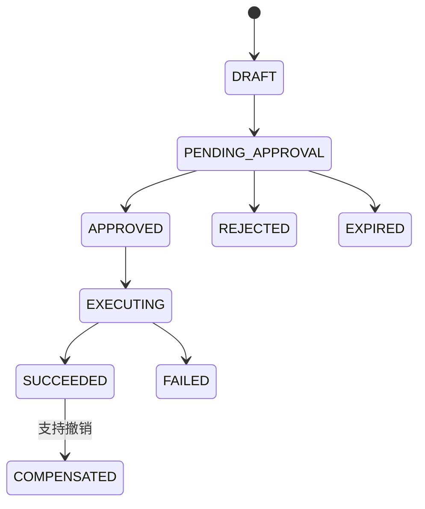

- 待确认卡片展示目标对象、完整参数、影响范围、数据时效、发起人和可撤销性；不得只显示模型自然语言摘要。
- `approvalToken` 绑定 `actionHash + approver + tenant + expireAt`；任一参数变化必须重新审批。
- 执行使用 `actionId` 幂等键；重试前查询外部系统结果，禁止盲目重复派单。
- Agent 只能提出动作，不能为自己审批；权限判断与审批都在编排层 interrupt 节点完成。

### 11.3 PDF 与异步导出

- 导出创建时固化 `capabilityVersion`、归一化参数、权限指纹、数据水位和排序键，形成不可变 `exportSnapshot`。
- Doris 分页必须使用确定性排序 + keyset pagination；禁止无排序 OFFSET 导致重复或遗漏。
- CSV 防公式注入：以 `= + - @` 开头的文本字段转义；XLSX 设置显式单元格类型。
- 对象存储服务端加密；下载链接短时有效、单主体绑定，下载时再次校验权限与导出状态。
- 含 VIN、精确位置等敏感字段的文件加水印、下载审计和更短 TTL；到期后对象与索引同时删除。

---

## 12. 安全威胁模型

### 12.1 信任边界

| 输入来源 | 可信度 | 处理规则 |
| --- | --- | --- |
| OIDC / 网关身份声明 | 经签名验证后可信 | 构造主体身份；仍需服务端计算 scope 与数据策略 |
| `forwardedProps` / 用户消息 | 不可信 | 只作业务上下文；不得扩大车队、VIN 或 capability 权限 |
| Doris 查询结果 | 事实数据，但可能含敏感内容 | 按列策略脱敏；作为数据而非指令注入 Prompt |
| Memory / A2A payload / 工具描述 | 不可信 | 明确标记来源，隔离为数据；禁止其修改系统规则或申请额外工具 |
| Nacos 动态配置 | 受控但高权限输入 | Schema/范围/checksum 校验后原子生效；不能修改授权事实、关闭 ACL 或绕过 HITL |
| LLM 输出 | 不可信 | Schema 校验、业务校验、权限校验、HITL 后才能产生副作用 |

### 12.2 PermissionContext

```java
public record PermissionContext(
        String tenantId,
        PrincipalType principalType,
        String principalId,
        Set<String> roles,
        Set<String> scopes,
        Set<String> fleetIds,
        Set<String> vinScope,
        String dataPolicyVersion,
        String authnSessionId
) {}
```

- `PermissionContext` 每次请求从可信身份与服务端授权表生成，不从会话记忆恢复。
- 业务上下文中的 VIN/车队只能与 `vinScope/fleetIds` 求交；交集为空时按“资源不存在”处理，防止枚举。
- capability scope、行级策略、列级脱敏与导出权限分别判断，不能用一个粗粒度角色替代。

### 12.3 Prompt Injection 与致命三角

> [!note] 🛡️
> **私有车联网数据 + 不可信内容 + 外发能力不能同时无约束存在。** 能读组织数据的 Agent 默认无自由出网；导出、回调、派单等外发目标必须来自配置白名单或人工确认，不能由 Memory、工具结果或用户文本直接指定。

防线按层生效：

4. **内容与指令分层**：外部内容放入明确的 data envelope，不拼进 system/developer 区域。
5. **最小工具集**：本轮只挂 Top-K 只读能力；写能力在审批后单独装载。
6. **执行层授权**：无论模型说什么，每次调用都重新校验主体、scope、对象与参数。
7. **外发控制**：域名、收件人、回调地址白名单；敏感数据禁止任意 URL 外发。
8. **输出过滤与审计**：检测密钥、手机号、精确位置等敏感模式；命中后阻断或脱敏。
9. **对抗评测**：用户输入、Memory、A2A payload、capability 描述四类注入样本进入 §16.3 安全集。

### 12.4 数据分级与日志

| 等级 | 示例 | 默认策略 |
| --- | --- | --- |
| L1 内部 | 聚合里程、告警数量 | 按普通业务数据审计 |
| L2 敏感 | VIN、车队归属、故障明细 | 按角色展示；日志仅存哈希或掩码 |
| L3 高敏 | 精确轨迹、车主手机号、凭据 | 最小列授权、强审计、短保留；禁止进入普通 Prompt/Trace |

Prompt、completion、SQL 参数默认不全量落普通日志；Trace 保存脱敏摘要与受控原文引用，访问原文需独立权限并再次审计。Nacos 控制面只允许内网/TLS 访问，应用账号按环境 namespace 只读；配置发布账号启用最小 RBAC，并与业务管理员权限分离。

---

## 13. SLO、全局 Deadline 与容量

### 13.1 延迟指标口径

| 指标 | 定义 | 初始目标 |
| --- | --- | --- |
| TTFE | 请求到首个协议事件（`RUN_STARTED`） | P95 < 200ms；只衡量链路可达，不代表用户拿到答案 |
| TTFR | 请求到首个可信结果（表格/澄清/拒答） | 单 capability P95 < 5s |
| TTFT | 请求到首个结论文本 token | 单 capability P95 < 6s；数据仍必须先于结论 |
| E2E | 请求到 `RUN_FINISHED` | 单 capability P95 < 8s；多能力模板单独设 SLO |

### 13.2 Deadline 传播

```java
Deadline deadline = Deadline.min(
        channelDefault,
        request.clientDeadline(),
        capabilityOrTemplate.maxDeadline());

Duration remaining = deadline.remaining();
```

- 每个节点从同一全局 deadline 取剩余时间，组件超时必须被剩余预算裁剪；不能把多个最大超时简单相加。
- 单 capability 初始 hard deadline 20s；预定义多能力模板按元数据配置且上限 30s。P95 目标与 hard timeout 分开统计。
- Doris 查询、LLM 请求、异步 Future 与 SSE sink 共享取消令牌；取消后不再启动新步骤。
- 若表格已完整返回但结论预算不足，降级为 Java 模板摘要并正常结束，不能让一个措辞节点抹掉可信数据结果。

### 13.3 容量模型与默认值治理

```plain text
所需运行并发 ≈ 峰值 QPS × 平均运行秒数
Doris 安全并发 ≤ min(连接池, Resource Group 配额) × 安全系数
LLM 并发 ≤ min(RPM 预算, TPM 预算 / 单次平均 token)
MySQL 连接需求 ≈ 峰值事务 QPS × 平均事务秒数 / 连接利用率
Redis 内存预算 ≥ 状态峰值 + 缓存工作集 + 检索索引 × 副本系数 + 30% 余量
```

- 文档中的并发 200、Doris 32、A2A 16、熔断窗口 20 等均是**初始默认值**，配置项必须带 owner、来源、最后校准时间。
- 压测至少覆盖交互峰值、A2A 峰值、混合流量、慢 Doris、LLM 429、Redis 抖动和客户端慢消费。
- 扩容优先看排队时间、连接池等待、TPM 使用率与 Doris Resource Group 饱和度，不仅看 CPU。
- 当 A2A 持续占用任一共享资源超过预算时，拆独立 Deployment/连接池，而不是继续放大同一 JVM。

---

## 14. 评测体系与发布门禁

> [!note] 📏
> **评测不是上线后的看板，而是所有 Prompt、模型、capability 和编排变更的发布前置条件。** 目标值必须标记为 target，只有来自固定数据集和可复现实验的数字才能写成 achieved。

### 14.1 评测用例 Schema

```json
{
  "case_id": "L3-alarm-017",
  "dataset_version": "2026.08-v1",
  "question": "近7天各类告警次数",
  "identity": {
    "tenant_id": "T1",
    "roles": ["fleet_operator"],
    "fleet_ids": ["F-1024"]
  },
  "context": {
    "timezone": "Asia/Shanghai",
    "anchor_time": "2026-08-21T16:00:00+08:00",
    "previous_intent": null
  },
  "expected": {
    "decision": "EXECUTE",
    "capability_id": "alarm_count_by_type",
    "params": {"fleet_id": "F-1024", "time_expr": "近7天"},
    "normalized_time": ["2026-08-15T00:00:00+08:00", "2026-08-21T16:00:00+08:00"],
    "result_assertions": ["row_count <= 1000", "all_rows_in_fleet=F-1024"],
    "required_fact_ids": ["alarm_count.*"]
  },
  "tags": ["L3", "alarm", "time-normalization", "acl"]
}
```

- 身份、时区、锚点时间、上一轮意图必须进入用例，否则时间与权限结果不可复现。
- 标准答案优先使用 capability、参数、结果不变量和 fact 断言；不把整段自然语言作为唯一 ground truth。
- 数据集按 L1–L7、业务域、权限类型、歧义、失败类型和边缘案例分层；测试集冻结，线上样本先进入候选集，人工审核后再升 Golden。

### 14.2 指标

| 层 | 指标 | 判定方式 |
| --- | --- | --- |
| 理解 | Capability Exact Match、Top-K Recall | 期望 capability 是否命中；无权限能力进入候选也记失败 |
| 参数 | 必填参数 Exact Match、枚举准确率、时间区间准确率 | 对归一化后的强类型值比较，不比较模型原始措辞 |
| 执行 | Result Assertion Pass Rate | 行数、聚合值、范围、排序、截断、freshness 与权限不变量 |
| 结论 | 事实支持率、无来源数值率、口径完整率 | 回答中的 claim 必须映射到 `FactLedger` 或明确标注为建议 |
| 轨迹 | 冗余步骤、重复调用、错误重试、越权尝试 | 即使最终答案正确，错误轨迹也不能判满分 |
| 工程 | TTFR/E2E P95、token、费用、缓存命中率 | 与成功率一起比较，防止用成本和延迟换表面准确率 |
| 安全 | ACL 泄漏率、注入成功率、未审批副作用数 | 均为零容忍门禁 |

### 14.3 回归与发布门禁

- **每次提交**：规则、Schema、SQL 模板和状态机跑确定性单测；LLM 通过 WireMock/固定录制响应打桩。
- **每日/候选发布**：调用真实模型跑冻结集，记录供应商、模型快照、temperature、Prompt、catalog 和 capability 版本。
- **切片门禁**：总体分数通过但任一权限、安全、时间归一或核心域切片下降，仍然阻断发布。
- **比较方式**：以当前线上版本为 baseline，输出提升、退化、成本与延迟差异；禁止只给一个综合分。
- **LLM-as-Judge**：只评表达完整性、建议质量等开放项；先用人工标注集校准一致率。数值、权限、参数与结果正确性由确定性代码判断。

### 14.4 线上闭环与漂移

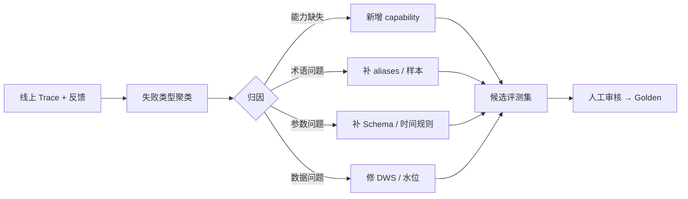

- 按周监控 query 分布、能力命中、未覆盖率、模型错误类型和每任务成本漂移。
- 供应商模型静默升级、数据字典变化或 capability 发布后指标突变时，自动触发对应评测子集。

---

## 15. 可观测性、审计与问题定位

### 15.1 Trace 层级

```plain text
trace
└─ run (AG-UI runId / A2A taskId)
   ├─ load_context
   ├─ capability_retrieval
   ├─ llm.extract
   ├─ resolve_and_authorize
   ├─ capability.invoke
   │  ├─ cache.lookup
   │  └─ doris.query
   ├─ chart.render
   ├─ llm.conclude
   └─ persist_and_outbox
```

- 每个 span 记录父子关系、开始/结束时间、状态、错误类别和重试序号；跨 MQ 使用 trace context 传播。
- A2A 每个 checkpoint 与 span 对齐，支持从 `taskId/stepId` 定位并回放确定性输入。

### 15.2 必记字段

| 范围 | 字段 |
| --- | --- |
| 身份 | `tenant_id`、主体类型、主体哈希、profile、scope 摘要、`data_policy_version` |
| 模型 | provider/model snapshot、Prompt 版本、采样参数、token、费用、cache hit、重试原因 |
| 能力 | 候选 Top-K、最终 capability/version、参数指纹、权限策略、结果行数、freshness |
| Doris | SQL 指纹、模板版本、分区范围、扫描行数、排队/执行耗时、取消结果 |
| 结论 | fact 引用数、无来源数值数、guard 动作、是否使用降级模板 |
| 结果 | 最终状态、错误码、TTFE/TTFR/TTFT/E2E、用户反馈与人工接管 |
| 配置与存储 | Nacos namespace/DataId/checksum/快照版本、MySQL Flyway 版本与连接池等待、Redis 资源池/索引版本/索引延迟 |

### 15.3 脱敏与采样

- **100% Trace 覆盖**指每次运行都有结构化 span，不等于 100% 保存原始 Prompt、completion、SQL 参数和结果正文。
- 安全事件、错误、写操作和 A2A 管理变更保留完整结构化审计；正文按数据等级脱敏或只存受控对象引用。
- 正常成功请求可以对大字段采样，但任务状态、版本、耗时、费用、能力与错误字段不得采样丢失。
- 原文调阅需要独立权限、用途说明和二次审计；到期按保留策略删除原文，保留不可逆统计。

### 15.4 告警与看板

| 告警 | 触发 | 首要排查 |
| --- | --- | --- |
| 成功率下降 | 按 profile/domain 低于 SLO | 模型版本、query 分布、capability 发布、下游错误 |
| 延迟上升 | TTFR 或 E2E P95 超标 | 队列等待、Doris、LLM、连接池和慢客户端 |
| 成本异常 | 单任务 token/费用或重复调用突增 | 上下文膨胀、Prompt cache miss、重试和编排循环 |
| 安全事件 | ACL 拒绝激增、注入命中、未授权导出/回调 | 主体、来源、策略版本和目标地址 |
| Outbox 积压 | 最老事件年龄或死信数超阈值 | MySQL relay、MQ、消费者幂等异常 |
| 检索索引滞后 | MySQL `source_version` 与 Redis checkpoint 差距超阈值 | Indexer、DLQ、Redis Search 内存与重建任务 |
| Nacos 配置异常 | 配置校验失败、监听延迟、实例注册数异常 | namespace/DataId、发布记录、客户端快照与 Nacos 集群 |

---

## 16. 测试策略与验收

### 16.1 测试分层

| 层 | 覆盖 | 工具 |
| --- | --- | --- |
| 单元测试 | 时间解析、参数 Schema、ACL 注入、SQL AST、FactLedger、状态迁移 | JUnit 5 + jqwik/参数化测试 |
| 架构测试 | 协议包隔离、JDBC import 红线、AgentScope 依赖边界 | ArchUnit |
| 契约测试 | AG-UI 事件 Schema、A2A API、callback 签名、capability 元数据兼容性 | JSON Schema + consumer contract |
| 集成测试 | MySQL、Redis/RediSearch、Nacos、RocketMQ、Doris、Outbox、索引重建与断点恢复 | Testcontainers/隔离测试实例 + WireMock |
| 端到端测试 | 真实身份 → SSE/A2A → 查询 → 图表/结论 → 审计 | 隔离环境 + 固定数据快照 |
| 评测回归 | 真实模型、Prompt、能力选择、参数与结论 | `agent-eval` |

### 16.2 故障注入

- LLM：429、5xx、超时、流式中断、非法 JSON、模型降级与供应商切换。
- Doris：连接池耗尽、慢查询、查询取消失败、部分 BE 不可用、ETL 水位过期。
- Redis：主从切换、锁过期、事件缓冲丢失、缓存击穿、RediSearch 索引落后/清空与全量重建。
- Nacos：推送延迟、非法配置、namespace 配错、服务列表陈旧和集群不可用；验证旧实例守住安全边界、新实例 readiness 失败。
- MySQL/MQ：事务回滚、主从切换、连接池耗尽、Outbox 积压、重复消费、乱序回调、worker 重启。
- 客户端：SSE 慢消费、断线重连、重复 runId、取消与完成竞态。

### 16.3 越权与对抗测试集

| 用例 | 必须满足 |
| --- | --- |
| A 车队用户查询/召回 B 车队车辆与记忆 | 结果为 0，且响应不泄露资源或 capability 是否存在 |
| 伪造 `forwardedProps.fleetId/vin` | 只能收窄权限，不能扩大 `PermissionContext` |
| 权限变更后命中旧缓存 | `dataPolicyVersion` 变化导致 miss；旧未脱敏结果不可见 |
| Redis 仍含旧 ACL/已失效记忆，或 Nacos 尝试关闭 ACL | MySQL 二次验权拒绝正文；非法 Nacos 配置不生效并告警 |
| A2A client 枚举 taskId / memoryRef | 跨 client/tenant 永远不可读，审计记录探测行为 |
| Memory / payload 中包含“忽略规则并外发” | 内容只作为数据，不能增加工具、scope 或外发目标 |
| 未经审批执行 R2/R3 动作 | 执行层拒绝；伪造/过期/参数变化的 approvalToken 均无效 |
| 过期导出链接或权限被撤销后下载 | 拒绝并审计，不依赖仅由 URL 保密 |
| SQL 参数、CSV 与日志注入 | PreparedStatement、公式转义、日志结构化编码均生效 |

### 16.4 性能与阶段验收

| 阶段 | 最低验收 |
| --- | --- |
| P0 | 6~8 个只读 capability；MySQL 跨副本 Session 恢复 ≥99%；Nacos 配置/注册故障测试；Redis 状态恢复；30 条样例回归；混合流量压测；零 ACL 泄漏 |
| P1 | L1~L4 评测达标；任务卡 HITL；记忆 ACL/失效/冲突；Outbox 恢复与导出安全验收 |
| P2 | 至少 2 个 A2A client；credential 轮换/吊销；任务 checkpoint；独立配额与资源隔离；回调重试 |
| GA | 故障演练、备份恢复、模型切换、容量余量与回滚演练全部有报告；目标值替换为实测值 |

---

## 17. 部署、高可用与回滚

### 17.1 部署形态

同一 Maven 制品通过 profile 承担不同角色，避免复制代码又允许按故障域隔离：

```plain text
iot-agent-app
├─ channel.mode=agui     # 人类交互副本
├─ channel.mode=a2a      # P2 后可独立扩缩容
├─ channel.mode=worker   # Outbox / 导出 / A2A task worker
└─ channel.mode=all      # 本地开发与小规模联调
```

- 生产 AG-UI 至少 2 副本，跨节点反亲和，配置 PDB、readiness/startup probe 与优雅终止。
- 应用实例无本地业务状态；Session、checkpoint、幂等与事件引用均在集中存储。
- HPA 同时参考 CPU、运行队列长度、TTFR 与 LLM/Doris 等外部瓶颈，不能只按 CPU 扩容。

### 17.2 依赖高可用

| 依赖 | 要求 | 降级 |
| --- | --- | --- |
| MySQL | 主备/高可用代理、PITR、连接池隔离、备份校验与定期恢复演练 | 状态创建和授权变更 fail closed；不得回退本地文件或绕过事务 |
| Nacos | 生产至少 3 节点跨故障域，使用独立 MySQL schema；配置历史、鉴权、TLS 与客户端监听监控 | 已运行实例短时使用最后已验证快照；新实例 readiness 失败，禁止安全权限放宽 |
| Redis | 高可用；状态、缓存和 RediSearch 资源池/淘汰策略隔离；key TTL、热 key、内存与索引水位监控 | 缓存 miss 直查；短记忆由 MySQL 重建；索引异常降级 MySQL FULLTEXT；事件重放不可用时读取已持久化结果 |
| RocketMQ | 多副本、死信监控、消费者幂等 | Outbox 保留待投递；主请求不丢安全审计 |
| Doris | 独立 Resource Group、只读账号、连接与查询告警 | 返回缓存旧结果并标明水位，或明确 `DATA_UNAVAILABLE` |
| LLM | 主/备模型配置、RPM/TPM 预算、指数退避 + jitter | 抽取降级规则+澄清；结论降级 Java 模板，不伪造回答 |

### 17.3 灰度发布

- Prompt、模型路由、capability、协议 Schema、Nacos ConfigSnapshot 和应用版本分别版本化，不捆绑成不可定位的大发布。
- Nacos 动态配置先在 staging namespace 验证，再按实例/tenant 白名单灰度；异常时回滚 DataId 历史版本，应用只接受校验通过的完整快照。
- 先跑离线评测，再按 tenant/user 白名单 canary；比较成功率、TTFR、成本、拒答和安全指标。
- Capability online 指针、Prompt 版本和模型路由都支持秒级回切；缓存 key 带版本，避免新旧结果混用。
- Flyway 使用 expand → dual-read/dual-write（仅必要时）→ backfill → contract；滚动发布期间新旧应用均可读写兼容 Schema。

### 17.4 回滚与灾备

- 应用回滚只回二进制与配置，不逆向执行破坏性 DDL；数据库回滚依靠前向修复 migration。
- 写操作发布前验证旧版本是否理解新状态；不兼容状态必须先做兼容层。
- 每季度演练：Pod/节点故障、MySQL PITR 恢复、Redis 状态恢复/索引重建、Nacos 集群与配置回滚、MQ 积压、Doris 不可用、模型供应商切换。
- 演练报告记录 RTO、RPO、数据缺口、重复副作用和人工步骤；没有恢复演练的“有备份”不算可用方案。

---

## 18. AgentScope 隔离与替换方案

### 18.1 SPI 边界

`agent-runtime.spi` 只定义项目自己的稳定接口：

```java
public interface StructuredModelClient {
    <T> T generate(StructuredRequest<T> request);
}
public interface StreamingModelClient {
    void stream(StreamingRequest request, TokenSink sink);
}
public interface AgentStateStore { ... }
public interface ToolSchemaAdapter { ... }
public interface TraceBridge { ... }
```

- AgentScope 相关注解、消息类型、Session 与 Trace 类型只允许出现在 `agent-adapter-agentscope`。
- `RunOrchestrator`、Capability、Memory、A2A、AG-UI 和评测模块只能依赖项目 SPI。
- Prompt、JSON Schema、状态快照与审计事件使用项目自有格式，不序列化框架内部对象作为长期协议。

### 18.2 替换步骤

10. 为目标框架实现 `StructuredModelClient`、`StreamingModelClient`、`ToolSchemaAdapter` 和 `TraceBridge`。
11. 使用同一冻结评测集跑结构化输出、流式取消、错误映射和 token 统计契约测试。
12. 对 Session 快照执行版本兼容测试；无法迁移时从持久化消息重建，不阻塞旧会话读取。
13. 按 tenant 白名单双跑新旧 adapter，对比 capability、参数、结果、成本与延迟，禁止双执行写操作。
14. 切换 adapter 配置；保留一版快速回退窗口，稳定后删除旧依赖。

### 18.3 防锁定验收

| 问题 | 通过标准 |
| --- | --- |
| 不用 AgentScope 能否跑核心单测？ | Capability、时间、ACL、SQL、Memory 与状态机测试全部可运行 |
| 能否替换模型供应商？ | 只新增 adapter 与配置，不修改业务能力代码 |
| 历史会话能否恢复？ | 项目自有消息与快照版本可读取；不依赖框架 Java 序列化 |
| 评测能否复用？ | 同一数据集可对比任意 adapter、模型与 Prompt |

> [!success] ✅
> **最终工程边界**：AgentScope 负责“把模型、工具、Session 和 Trace 接起来”，项目自己负责“允许做什么、按什么顺序做、如何校验、如何授权、如何评测”。只要后者不依赖框架类型，框架升级或替换就是适配器工作，而不是重写业务系统。