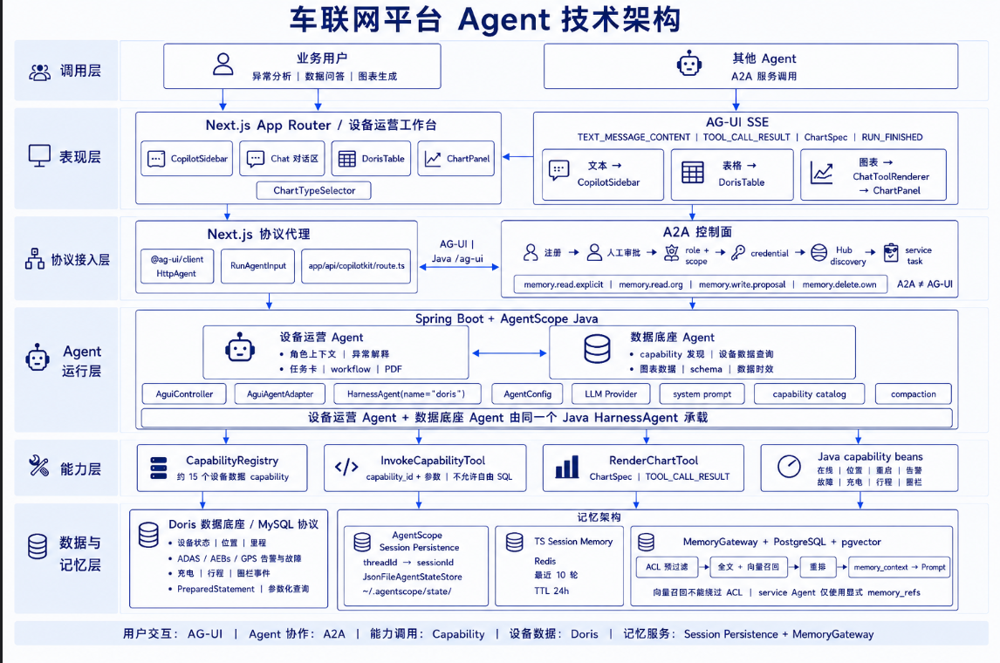
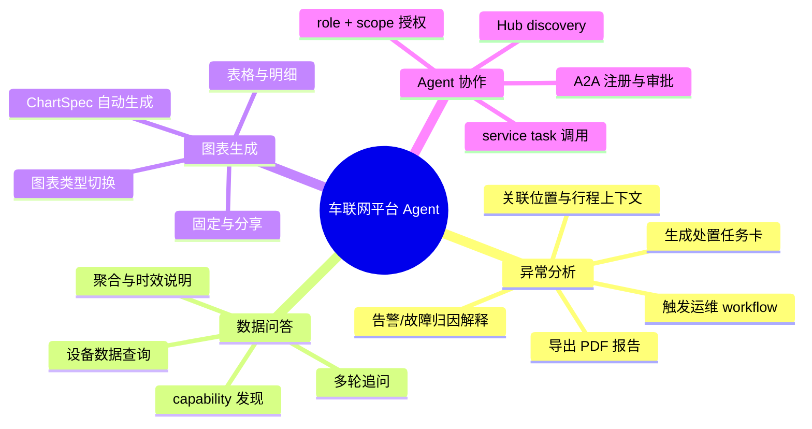
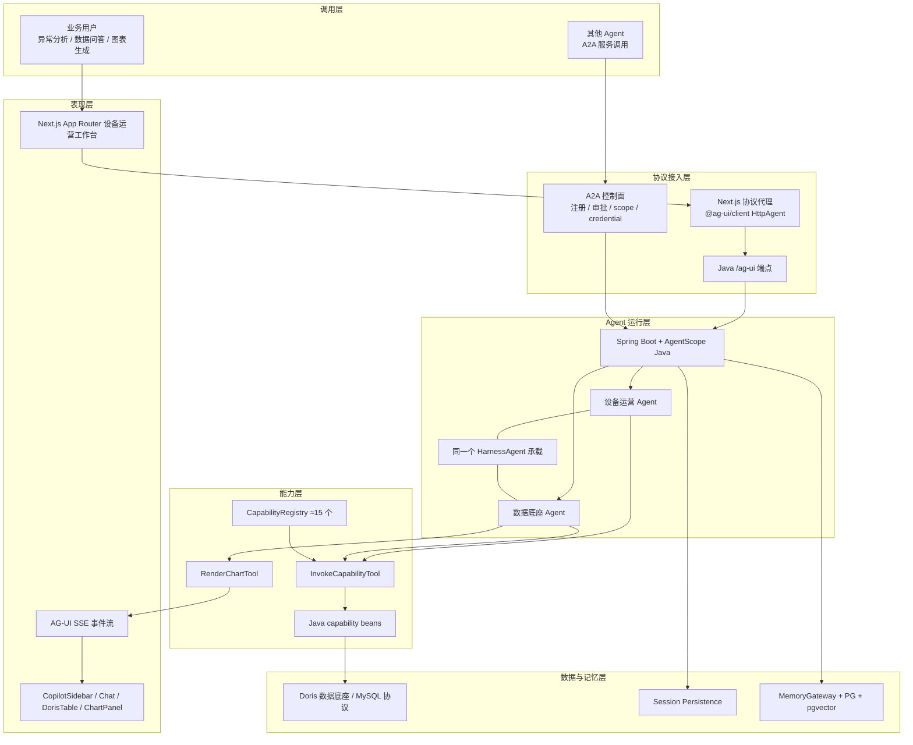
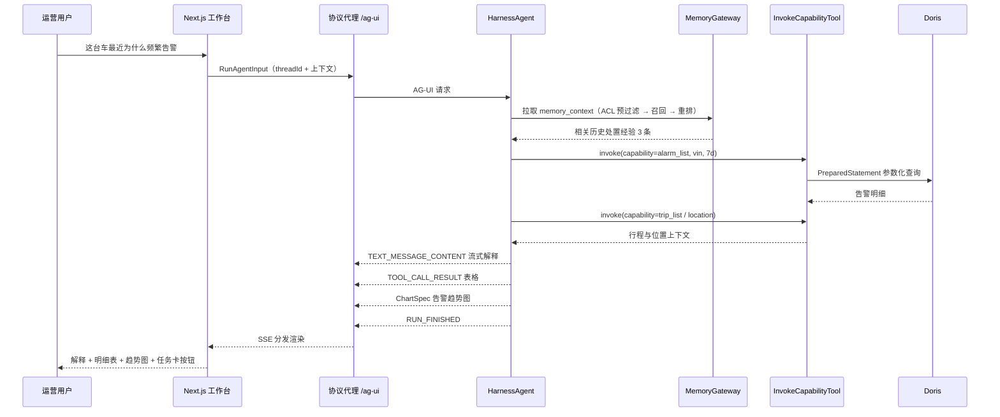
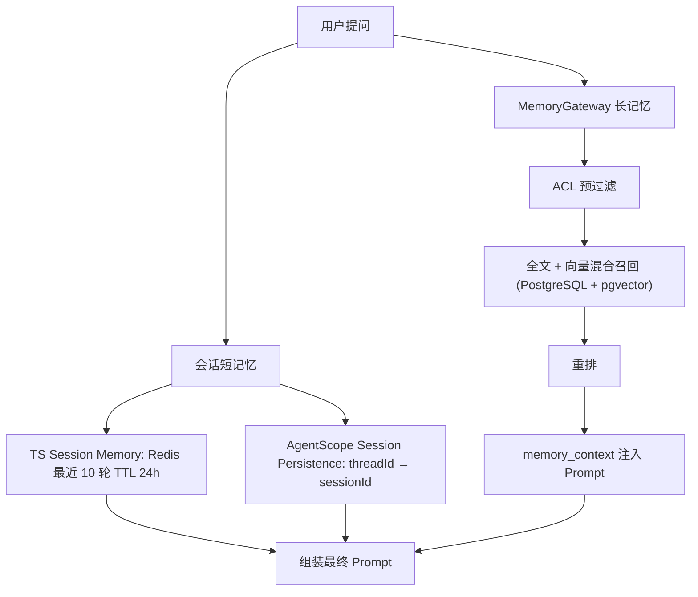
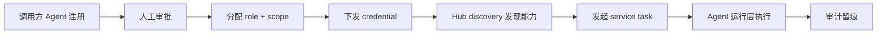
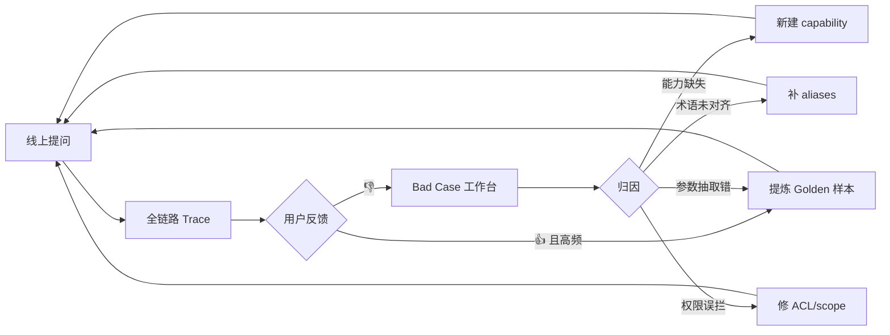

> 一句话定位：一个由 **设备运营 Agent + 数据底座 Agent** 组成的车联网智能体产品——业务用户用一句话完成「异常分析 / 数据问答 / 图表生成」，其他 Agent 通过 A2A 把它当作可复用的车联网能力服务调用。

> [!note] 🧭
> **架构结论先行**：四条协议边界必须一开始就划清——**用户交互走 AG-UI，Agent 协作走 A2A，数据能力走 Capability（不允许自由 SQL），记忆走 Session + MemoryGateway**。这四条边界是本产品所有设计的地基，也是与「又一个套壳 Chat」的根本区别。



---

## 1. 背景与产品定位

### 1.1 现状问题

车联网平台已经沉淀了大量设备侧数据（设备状态、位置、里程、ADAS/AEB 告警、故障、充电、行程、围栏事件），但消费方式仍然割裂：

| 现实痛点                         | 今天的做法        | 本产品的解法                                   |
| ---------------------------- | ------------ | ---------------------------------------- |
| 车辆异常了，运营不知道该怎么读、下一步做什么       | 翻多个页面 + 找研发问 | 设备运营 Agent 给出异常解释 + 任务卡 + 处置 workflow    |
| 想看的数据维度天天变                   | 提需求排期出报表     | 数据底座 Agent 即席问数，直接出表出图                   |
| 大模型直连数据库风险极高                 | 不敢开放         | Capability 白名单 + 参数化查询，禁止自由 SQL          |
| 公司内其他 Agent 想用车联网数据，只能各自重写一遍 | 能力重复建设       | A2A 对外暴露标准服务，注册审批 + scope 授权             |
| 多轮对话记不住上下文，换个副本就失忆           | 无持久记忆        | Session Persistence + MemoryGateway 双层记忆 |

### 1.2 产品定位

**不是 BI，不是监控大屏，而是「设备运营的第一入口 + 车联网能力的对外供应商」。**

| 维度 | 本产品是 | 本产品不是 |
| --- | --- | --- |
| 交互形态 | 对话 + 结果卡片（Copilot 侧边栏 / 工作台） | 拖拽式仪表盘搭建器 |
| 数据能力 | 约 15 个受控 capability 的组合调用 | 任意 SQL 查询引擎 |
| 对外形态 | A2A 可被其他 Agent 调用的服务 | 只有 UI、没有 API 的孤岛应用 |
| 智能程度 | 确定性主链路 + LLM 只负责理解与填槽 | 让模型自由决定查什么、怎么查 |

---

## 2. 目标用户与核心场景

### 2.1 用户角色

| 角色             | 典型诉求                            | 主要使用的 Agent        |
| -------------- | ------------------------------- | ------------------ |
| 车队运营 / 设备运营    | 「这台车昨天为什么频繁告警」「给我一张处置任务卡」       | 设备运营 Agent         |
| 业务经理           | 「各车队近 7 天里程对比」「充电量趋势」           | 数据底座 Agent         |
| 售后 / 运维        | 「近 3 天 AEB 触发的车辆清单」「离线超 24h 的车」 | 数据底座 Agent + 明细导出  |
| 管理层            | 周报 PDF、异常概览                     | 设备运营 Agent（PDF 导出） |
| 其他 Agent（机器用户） | 调用「查询车辆在线状态」「查询告警明细」等标准能力       | A2A service task   |
| 平台管理员          | capability 上下线、A2A 授权审批、记忆治理    | 管理后台               |

### 2.2 三大核心场景



### 2.3 场景分层（决定优先级）

| 层级              | 场景样例                | 依赖                              | 阶段  |
| --------------- | ------------------- | ------------------------------- | --- |
| L1 单点查询         | 「车牌 XXX 现在在线吗、在哪」   | 1~2 个 capability                | P0  |
| L2 清单查询         | 「近 3 天触发 AEB 的车辆列表」 | capability + 表格渲染               | P0  |
| L3 聚合出图         | 「各车队近 7 天里程对比」      | 聚合 capability + RenderChartTool | P0  |
| L4 异常解释         | 「这台车为什么连续报故障」       | 多 capability 编排 + 角色上下文         | P1  |
| L5 处置闭环         | 「生成维修任务卡并派单」        | 任务卡 + workflow                  | P1  |
| L6 多轮 + 记忆      | 「那前天呢」「还是刚才那台车」     | Session + MemoryGateway         | P1  |
| L7 被其他 Agent 调用 | 调度 Agent 调用「查询车辆位置」 | A2A 控制面                         | P2  |

---

## 3. 系统分层设计

### 3.1 六层架构



### 3.2 各层职责与产品要求

| 层 | 核心组件 | 产品级要求 |
| --- | --- | --- |
| **调用层** | 业务用户、其他 Agent | 两类调用方共用同一套能力，但**权限模型必须分离**：人有 UI 会话，Agent 只有 service task |
| **表现层** | CopilotSidebar、Chat 对话流、DorisTable、ChartPanel、ChartTypeSelector | AG-UI SSE 事件按类型分发渲染：文本→侧边栏、表格→DorisTable、ChartSpec→ChatToolRenderer→ChartPanel；必须流式，不能转圈等待 |
| **协议接入层** | Next.js 协议代理、`/ag-ui` Java 端点、A2A 控制面 | **A2A ≠ AG-UI**，两套协议不得混用；A2A 必须走「注册 → 人工审批 → role+scope → credential → Hub discovery → service task」完整链路 |
| **Agent 运行层** | Spring Boot + AgentScope Java、两个 Agent 由同一 HarnessAgent 承载 | Agent 差异只体现在 system prompt + capability catalog + 角色上下文，不做两套工程；上下文超限走 compaction |
| **能力层** | CapabilityRegistry、InvokeCapabilityTool、RenderChartTool、capability beans | **模型只能传 capability_id + 参数，永不产出 SQL**；每个 capability 有独立的入参校验、超时、行数上限 |
| **数据与记忆层** | Doris（MySQL 协议、PreparedStatement）、Session Persistence、MemoryGateway | 全部参数化查询；记忆分「会话短记忆」与「组织长记忆」两层，向量召回**不能绕过 ACL** |

---

## 4. 两个 Agent 的职责边界

> [!warning] ⚠️
> 两个 Agent 由**同一个 Java HarnessAgent 承载**，这是重要的工程约束：不要因为「产品上是两个 Agent」就拆成两个服务，否则会话、记忆、capability 目录都要复制一遍。

|   | 设备运营 Agent | 数据底座 Agent |
| --- | --- | --- |
| 定位 | 面向「怎么办」 | 面向「是什么」 |
| 核心能力 | 角色上下文、异常解释、任务卡、workflow、PDF 导出 | capability 发现、设备数据查询、聚合数据、schema 说明、数据时效 |
| 典型问题 | 「这台车为什么一直报故障，我该做什么」 | 「近 7 天各车队里程」「这个字段什么意思」 |
| 输出形态 | 解释文本 + 任务卡 + PDF | 表格 + 图表 + 口径说明 |
| 是否可被 A2A 调用 | P2 起（有副作用，需强审批） | P2 首批开放（只读，风险低） |
| 记忆使用 | 可读组织记忆（车辆历史处置经验） | 主要用会话记忆 |

### 4.1 一次异常分析的完整链路



---

## 5. 能力层设计（本产品最核心的资产）

### 5.1 设计原则

> [!note] 🔒
> **红线：不允许模型生成自由 SQL。** 模型的输出只能是 `capability_id` + 结构化参数，由 Java capability bean 用 PreparedStatement 执行确定性查询。这条红线同时解决了越权、慢查询、注入、幻觉字段四个问题。

### 5.2 首批 capability 清单（约 15 个）

| 域 | capability 示例 | 类型 | 阶段 |
| --- | --- | --- | --- |
| 在线状态 | `vehicle_online_status`、`offline_vehicle_list` | 单点 / 清单 | P0 |
| 位置 | `vehicle_last_location`、`vehicle_track` | 单点 / 时序 | P0 |
| 里程 | `mileage_daily`、`mileage_by_fleet` | 聚合 | P0 |
| 告警 | `alarm_list`、`alarm_count_by_type`（含 ADAS / AEB / GPS） | 清单 / 聚合 | P0 |
| 故障 | `fault_list`、`fault_top_vehicles` | 清单 / 聚合 | P1 |
| 充电 | `charge_session_list`、`charge_energy_daily` | 清单 / 聚合 | P1 |
| 行程 | `trip_list`、`trip_summary` | 清单 / 聚合 | P1 |
| 围栏 | `geofence_event_list` | 清单 | P1 |

### 5.3 capability 元数据规范

```yaml
capability:
  id: alarm_count_by_type
  display: 按类型统计告警次数
  description: 统计指定时间范围内车辆告警次数，按告警类型分组
  aliases: [告警统计, 报警次数, 哪类告警最多]
  domain: alarm
  readonly: true
  params:
    - name: vin_list
      type: array<string>
      required: false
    - name: fleet_id
      type: string
      required: false
    - name: time_range
      type: daterange
      required: true
      max_span_days: 90
  returns:
    shape: table
    columns: [alarm_type, alarm_count]
  chart_hint: bar
  freshness: T+0（准实时，延迟约 5 分钟）
  limits: { max_rows: 1000, timeout_ms: 15000 }
  scopes: [vehicle.alarm.read]
  owner: 数据组
```

> [!tip] 💡
> `aliases`、`freshness`、`chart_hint`、`scopes` 四个字段看起来是附加信息，实际决定了产品体验上限：别名决定召回准确率，时效决定用户信任，图表提示决定出图质量，scope 决定 A2A 能不能安全开放。

### 5.4 图表生成：RenderChartTool

| 数据形态 | 默认 ChartSpec 类型 |
| --- | --- |
| 1 指标 + 0 维度 | 指标卡（带环比） |
| 1 指标 + 1 类别维度（≤20 项） | 柱状图 |
| 1 指标 + 1 时间维度 | 折线图 |
| 指标 + 时间 + 类别 | 多系列折线 / 堆叠柱 |
| 含经纬度 | 地图（车联网强需求） |
| 明细清单 | DorisTable 表格 + 导出 |

后端只返回 **ChartSpec**，前端 ChartPanel 负责渲染，用户可通过 ChartTypeSelector 切换类型而**不重新请求模型**。

---

## 6. 记忆架构（双层 + ACL）



| 层 | 存储 | 作用 | 关键约束 |
| --- | --- | --- | --- |
| 会话短记忆 | Redis，最近 10 轮，TTL 24h | 多轮追问的直接上下文 | 轮数与 TTL 都要可配置，超限触发 compaction 而非截断丢弃 |
| 会话持久化 | AgentScope Session Persistence（`threadId → sessionId`，`JsonFileAgentStateStore`） | 跨副本 / 重启恢复会话 | P1 起从本地文件切换为集中存储（PG/Redis），文件态只适合单机打样 |
| 组织长记忆 | MemoryGateway + PostgreSQL + pgvector | 沉淀车辆处置经验、口径、用户偏好 | 四类权限：`memory.read.explicit`、`memory.read.org`、`memory.write.proposal`、`memory.delete.own` |

> [!note] 🔐
> **两条记忆红线**：
1. **向量召回不能绕过 ACL** —— ACL 必须在召回前预过滤，而不是召回后再筛，否则会出现「相似度把别人车队的数据带出来」的越权泄漏。
2. **service Agent（A2A 调用方）仅使用显式 **`**memory_refs**` —— 机器调用方不允许做组织级模糊召回，只能读取被显式传入的记忆引用。

写入采用 **proposal 机制**：Agent 只能提交记忆写入建议，由用户确认或管理员审核后落库，避免把错误结论固化成「组织常识」。

---

## 7. A2A 控制面（对外供能）



| 环节 | 产品要求 |
| --- | --- |
| 注册 | 调用方需提交用途、频率预估、数据范围 |
| 人工审批 | **不做自动放行**；只读能力可走轻审批，写操作必须双人审批 |
| role + scope | scope 粒度对齐 capability 的 `scopes` 字段，最小授权 |
| credential | 可轮换、可吊销、有有效期 |
| Hub discovery | 调用方只能发现自己 scope 内的 capability |
| service task | 无 UI 会话、无组织记忆召回、强制配额与限流 |
| 审计 | 谁、何时、调了什么、参数、返回行数、耗时，全量留痕可导出 |

> [!note] 🧱
> **A2A ≠ AG-UI**。AG-UI 是「给人看的流式渲染协议」，A2A 是「给机器用的任务协议」。不要为了省事让 A2A 复用 SSE 事件流，也不要让 AG-UI 承载任务生命周期语义——混用会导致权限模型和错误处理双双失控。

---

## 8. 页面与功能清单

### 8.1 页面地图

| # | 页面 | 使用者 | 阶段 | 职责 |
| --- | --- | --- | --- | --- |
| P1 | **设备运营工作台**（主页） | 业务 | P0 | Chat 对话流 + DorisTable + ChartPanel 三区联动 |
| P2 | CopilotSidebar（嵌入现有平台） | 业务 | P0 | 在原有车辆详情页右侧唤起，带当前车辆上下文 |
| P3 | 异常分析详情 / 任务卡 | 运营 | P1 | 解释结论 + 处置建议 + 派单 + PDF 导出 |
| P4 | 全屏图表分析页 | 业务 | P1 | 换图、调参数、明细下钻、导出 |
| A1 | **Capability 管理后台** | 管理员 | P0 | capability CRUD、别名、限流、试跑、上下线 |
| A2 | A2A 授权与审批台 | 管理员 | P2 | 注册审批、scope 配置、credential 轮换 |
| A3 | 记忆治理台 | 管理员 | P1 | 记忆条目审核、ACL 配置、删除申诉 |
| A4 | 效果看板与审计 | 管理员 | P1 | 成功率、延迟、👍率、未覆盖问题榜、调用审计 |

### 8.2 工作台关键交互

- **三区联动**：对话区提问 → DorisTable 出明细 → ChartPanel 出图，三者共享同一次 `TOOL_CALL_RESULT`，不重复查询
- **流式分阶段反馈**：`正在理解 → 正在调用能力 → 正在出图 → RUN_FINISHED`，禁止 8 秒白屏
- **执行过程可见区**（默认收起）：命中的 capability、参数、数据时效、耗时、扫描行数
- **空状态引导**：能力边界说明 + 6~8 个真实可跑通的示例问题
- **追问引导**：基于当前参数变形生成（换时间、加维度、下钻单车），成本极低但显著提升单会话提问数
- **可中断 / 编辑重发**：长任务允许取消，上一条提问可编辑重跑
- **参数微调不走模型**：时间范围、Top N 直接改参数重跑 capability

### 8.3 四种回答形态

| 形态 | 触发条件 | 展现 |
| --- | --- | --- |
| 结果卡片 | capability 命中 | 文本结论 + 表格 / 图表 + 时效条 + 操作区 |
| 澄清气泡 | 缺时间 / 车辆歧义 / 多个 capability 候选 | 选项按钮，点一下重算，不让用户重打字 |
| 拒答卡片 | 能力未覆盖 / 超出 scope | 说清原因 + 「提交能力需求」按钮 |
| 失败卡片 | 超时 / 数据源异常 | 可重试 + 展示失败环节，不返回半截结果 |

---

## 9. 非功能需求

| 类别 | 指标 | P0 目标 | GA 目标 |
| --- | --- | --- | --- |
| 性能 | 首 token 延迟 | < 2s | < 1s |
| 性能 | 端到端 P95（单 capability） | < 8s | < 5s |
| 性能 | Doris 单查询 P95 | < 3s | < 2s |
| 准确率 | capability 选择准确率 | ≥ 90% | ≥ 96% |
| 准确率 | 参数抽取准确率（含时间归一） | ≥ 90% | ≥ 95% |
| 准确率 | 幻觉率（编造字段 / 数值） | < 1% | ≈ 0 |
| 可靠性 | Agent 服务可用性 | 99.5% | 99.9% |
| 可靠性 | 会话恢复成功率（跨副本） | ≥ 99% | ≥ 99.9% |
| 安全 | 自由 SQL 出现次数 | 0（架构上不可能） | 0 |
| 安全 | ACL 绕过事件 | 0 | 0 |
| 可观测 | 全链路 Trace 覆盖率 | 100%（含 capability 参数与 SQL 快照） | 100% |

### 9.1 数据侧护栏

- 所有查询走 **PreparedStatement 参数化**，禁止字符串拼接
- 强制注入 `LIMIT`、查询超时、时间范围上限（如 90 天）、必须命中分区键
- 只读账号 + 独立 Doris Resource Group，避免打爆生产报表
- 结果缓存：同 capability + 同参数 + 同权限上下文 → 缓存 5~15 分钟

---

## 10. 评测体系

> [!note] 📏
> 没有评测集就是盲人开车。建议构建 **200~300 条**真实问题黄金集（问题 → 期望 capability + 参数 → 期望结果），按 L1~L6 分层标注，每次改 prompt / 换模型 / 加 capability 都跑一遍回归。



---

## 11. 分期路线图

| 阶段 | 周期 | 交付范围 | 验收标准 |
| --- | --- | --- | --- |
| **P0 打样** | 3~4 周 | AG-UI 全链路跑通（Next.js 代理 + Java `/ag-ui`  • HarnessAgent）；6~8 个只读 capability；DorisTable + ChartPanel 渲染；Capability 管理后台；反馈按钮入库 | 30 条样例问题 capability 选择准确率 ≥ 85%，P95 < 10s，工作台可演示 |
| **P1 MVP** | 5~7 周 | capability 补齐至 ~15 个；设备运营 Agent 异常解释 + 任务卡 + PDF；澄清机制；双层记忆（Redis + MemoryGateway，含 ACL 预过滤）；会话持久化切集中存储；效果看板与审计 | L1~L4 准确率 ≥ 90%，会话恢复 ≥ 99%，内部 30 人试用周活 ≥ 20 |
| **P2 对外供能** | 4~6 周 | A2A 控制面全链路（注册/审批/scope/credential/discovery/service task）；只读能力对外开放；配额限流；多轮追问 + 明细下钻；全屏分析页 | ≥ 2 个外部 Agent 接入，0 越权事件，A2A 调用 P95 < 5s |
| **P3 智能化** | 持续 | 异常主动推送与归因、workflow 自动派单、记忆自学习（proposal 自动生成）、能力自动编排 | 主动推送采纳率 ≥ 30%，未覆盖问题率 < 10% |

---

## 12. 风险与应对

| 风险 | 影响 | 应对 |
| --- | --- | --- |
| capability 覆盖不足，用户问什么都答不上 | 用完即弃 | 拒答卡片 + 未覆盖问题榜驱动扩能力；P0 先窄后宽，只上高频 6~8 个 |
| 为了「灵活」放开自由 SQL | 安全与稳定性双崩 | 写入架构红线，Code Review 强制拦；确有需求走「新增 capability」流程 |
| ACL 在向量召回后才生效 | 数据越权泄漏，最严重风险 | ACL 预过滤写进 MemoryGateway 接口契约，加自动化越权测试用例 |
| A2A 与 AG-UI 协议混用 | 权限模型失控，返工 | 两套协议分端点、分鉴权、分测试；架构评审设为硬性检查项 |
| 两个 Agent 拆成两套工程 | 会话/记忆/能力目录重复建设 | 坚持同一 HarnessAgent 承载，差异只在 prompt + catalog |
| Session 用本地文件存储上生产 | 多副本失忆、扩容不可行 | P1 必须切集中存储，`JsonFileAgentStateStore` 仅限本地打样 |
| AgentScope Java 版本演进快 | 升级成本 | 锁定小版本；capability beans、编译校验、执行器写成普通 Java 组件，框架可替换 |
| 用户不信任 AI 给的数 | 推不动 | 强制透出数据时效、命中能力、执行过程；与现有报表做对数验证 |
| 上下文膨胀导致成本与延迟失控 | 体验与预算双超 | compaction + 记忆召回 Top-K 限制 + capability catalog 按需裁剪 |

---

## 13. 下一步动作清单

- [ ] 拉运营 + 数据各一人，2 小时会议敲定 P0 的 6~8 个 capability 定义（建议：在线状态、最后位置、日里程、车队里程、告警清单、告警类型统计）
- [ ] 盘点 Doris 现有表，确认是否已有可用的日聚合表，缺则先补 DWS 层
- [ ] 定义 capability 元数据 Schema 与 `InvokeCapabilityTool` 接口契约，先手写死一个 case 跑通全链路
- [ ] 搭起 AG-UI 骨架：Next.js 协议代理 → Java `/ag-ui` → HarnessAgent → SSE 事件回流渲染
- [ ] 定义 ChartSpec 协议（后端出 spec、前端渲染），与前端一次性对齐
- [ ] 明确 MemoryGateway 四类权限的接口契约，尤其 ACL 预过滤的调用顺序
- [ ] 收集业务真实问法 100 条作为评测集初稿（翻运营群聊天记录最快）
- [ ] 从第一天接入 Trace + 👍👎 反馈落库，哪怕后台页面还没做

[[前端设计文档（车联网平台 Agent · Aurora 设计体系）]]

[[后端设计文档（车联网平台 Agent · Spring Boot + AgentScope Java）]]